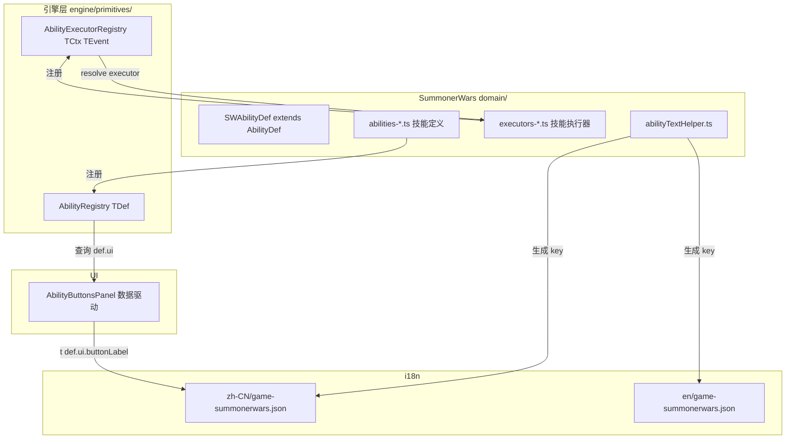

# 设计文档：SummonerWars 技能系统架构治理

## 概述

本设计解决 SummonerWars 的四个技能系统反模式 + SmashUp 的文本冗余问题。

### 现状诊断

| 反模式 | 严重度 | 现状 | 引擎层方案 |
|--------|--------|------|-----------|
| abilityText 三重冗余 | 高 | 卡牌配置 `abilityText`（死数据，无消费者）+ AbilityDef 硬编码中文 | 迁移至 i18n |
| 自建 AbilityRegistry | 中 | `abilities.ts` 自建 50 行 class，缺少 `getByTag`/`has`/`getRegisteredIds` | ✅ `createAbilityRegistry<TDef>()` |
| execute 巨型 switch-case | 高 | `execute/abilities.ts` 30+ case | ✅ `AbilityExecutorRegistry` |
| UI 逐技能 if 硬编码 | 高 | `AbilityButtonsPanel.tsx` 10+ 个 if 块，AbilityDef.ui 已定义但未消费 | ⚠️ 需补全 AbilityDef.ui 配置 + 改造 UI 组件 |

### 已做对的部分

- `abilityValidation.ts` 已经是数据驱动的（读 `AbilityDef.validation`）
- AbilityDef 接口已定义 `validation` 和 `ui` 字段，部分技能已填充
- 按钮文本已使用 i18n key（`t('abilityButtons.xxx')`）

## 架构

### 迁移后数据流



## 组件与接口

### 1. SWAbilityDef 接口改造

SummonerWars 的 AbilityDef 改为扩展引擎层泛型版本，仅添加游戏特有字段：

```typescript
// domain/abilities.ts
import { AbilityDef as EngineAbilityDef, createAbilityRegistry } from '../../../engine/primitives/ability';

/** SummonerWars 特有的技能定义扩展 */
export interface SWAbilityDef extends EngineAbilityDef<AbilityEffect, AbilityTrigger> {
  /** 是否需要玩家选择目标 */
  requiresTargetSelection?: boolean;
  /** 目标选择配置 */
  targetSelection?: { type: 'unit' | 'position' | 'card'; filter?: AbilityCondition; count?: number };
  /** 每回合使用次数限制 */
  usesPerTurn?: number;
  /** 音效 key */
  sfxKey?: string;
  /** 验证规则 */
  validation?: {
    requiredPhase?: 'summon' | 'move' | 'attack' | 'build';
    customValidator?: (ctx: ValidationContext) => ValidationResult;
  };
  /** UI 元数据 */
  ui?: {
    requiresButton?: boolean;
    buttonPhase?: 'summon' | 'move' | 'attack' | 'build';
    buttonLabel?: string;
    buttonVariant?: 'primary' | 'secondary' | 'danger';
    /** 可用性前置检查（快速判断，不走完整 validation） */
    quickCheck?: (core: SummonerWarsCore, playerId: PlayerId, unit: BoardUnit) => boolean;
  };
}

// 使用引擎层注册表，删除自建 class
export const abilityRegistry = createAbilityRegistry<SWAbilityDef>('sw-abilities');
```

**设计决策**：`SWAbilityDef` 扩展引擎层 `AbilityDef<AbilityEffect, AbilityTrigger>`，保留 SummonerWars 特有的 `validation`/`ui`/`usesPerTurn` 等字段。引擎层的 `condition`/`cost`/`cooldown`/`tags` 等通用字段自动继承。

### 2. abilityText Helper

```typescript
// domain/abilityTextHelper.ts（与 DiceThrone 模式一致）
export const abilityText = (id: string, field: 'name' | 'description'): string =>
  `abilities.${id}.${field}`;
```

### 3. AbilityDef 文本迁移

```typescript
// 迁移前
{ id: 'frost_bolt', name: '冰霜飞弹', description: '本单位相邻每有一个友方建筑...', ... }

// 迁移后
{ id: 'frost_bolt', name: abilityText('frost_bolt', 'name'), description: abilityText('frost_bolt', 'description'), ... }
```

### 4. execute 层 switch-case → AbilityExecutorRegistry

```typescript
// domain/executors/index.ts
import { createAbilityExecutorRegistry } from '../../../../engine/primitives/ability';
import type { SWAbilityContext, SWAbilityResult } from './types';

export const abilityExecutorRegistry = createAbilityExecutorRegistry<SWAbilityContext, GameEvent>('sw-executors');

// domain/executors/necromancer.ts
import { abilityExecutorRegistry } from './index';

abilityExecutorRegistry.register('revive_undead', (ctx) => {
  const events: GameEvent[] = [];
  // ... 原 case 'revive_undead' 的逻辑
  return { events };
});

abilityExecutorRegistry.register('fire_sacrifice_summon', (ctx) => { ... });
// ...

// domain/execute/abilities.ts（改造后）
export function executeActivateAbility(events, core, playerId, payload, timestamp) {
  const abilityId = payload.abilityId as string;
  // ... 查找源单位（保持不变）

  events.push(createAbilityTriggeredEvent(abilityId, sourceUnitId, sourcePosition, timestamp));

  const executor = abilityExecutorRegistry.resolve(abilityId);
  if (executor) {
    const ctx: SWAbilityContext = { sourceId: sourceUnitId, ownerId: playerId, timestamp, core, sourceUnit, sourcePosition, payload };
    const result = executor(ctx);
    events.push(...result.events);
  } else {
    console.warn('[SummonerWars] 未注册的技能执行器:', abilityId);
  }
}
```

**设计决策**：执行器按派系文件组织（`executors/necromancer.ts`、`executors/frost.ts` 等），与 `abilities-*.ts` 定义文件对应。每个执行器是纯函数，接收 `SWAbilityContext` 返回 `{ events }` 数组。

### 5. SWAbilityContext 定义

```typescript
// domain/executors/types.ts
import type { AbilityContext } from '../../../../engine/primitives/ability';
import type { SummonerWarsCore, PlayerId, BoardUnit, CellCoord } from '../types';

export interface SWAbilityContext extends AbilityContext {
  core: SummonerWarsCore;
  sourceUnit: BoardUnit;
  sourcePosition: CellCoord;
  payload: Record<string, unknown>;
}
```

### 6. AbilityButtonsPanel 数据驱动化

```typescript
// 迁移后的 AbilityButtonsPanel（核心逻辑）
export const AbilityButtonsPanel: React.FC<Props> = ({ core, currentPhase, ... }) => {
  const { t } = useTranslation('game-summonerwars');
  // ... 前置检查

  const abilities = unit.card.abilities ?? [];
  const buttons: React.ReactNode[] = [];

  for (const abilityId of abilities) {
    const def = abilityRegistry.get(abilityId);
    if (!def?.ui?.requiresButton) continue;
    if (def.ui.buttonPhase !== currentPhase) continue;

    // 快速可用性检查
    const quickCheckPassed = def.ui.quickCheck
      ? def.ui.quickCheck(core, myPlayerId as PlayerId, unit)
      : true;

    // 完整验证（用于 disabled 状态）
    const validationResult = validateAbilityActivation(core, myPlayerId as PlayerId, {
      abilityId, sourceUnitId: unit.cardId,
    });

    buttons.push(
      <GameButton
        key={abilityId}
        onClick={() => handleAbilityClick(abilityId, def)}
        variant={def.ui.buttonVariant ?? 'secondary'}
        size="md"
        disabled={!quickCheckPassed || !validationResult.valid}
        title={validationResult.error}
      >
        {t(def.ui.buttonLabel!)}
      </GameButton>
    );
  }

  if (buttons.length === 0) return null;
  return <div className="...">{buttons}</div>;
};
```

**设计决策**：新增 `ui.quickCheck` 函数字段，用于 UI 层快速判断按钮是否应该显示（如"弃牌堆中有亡灵单位"）。这比走完整 `validateAbilityActivation` 更轻量，且逻辑仍然定义在 AbilityDef 中而非 UI 层。

### 7. 卡牌配置 abilityText 移除

```typescript
// 迁移前
{ id: 'frost-mage', abilities: ['frost_bolt'], abilityText: '冰霜飞弹：...', ... }

// 迁移后
{ id: 'frost-mage', abilities: ['frost_bolt'], ... }
// abilityText 已移除（确认无运行时消费者）
```

### 8. SmashUp 卡牌文本迁移

设计与原 spec 一致：
- 卡牌定义新增 `textKey`/`nameKey` 字段
- 移除 `abilityText`/`abilityTextEn`/`effectText`/`effectTextEn`
- `resolveCardText`/`resolveCardName` 签名改为接收 `t: TFunction`
- 9 个 UI 调用点同步更新

## 文件变更清单

### SummonerWars

| 文件 | 变更类型 | 说明 |
|------|---------|------|
| `domain/abilities.ts` | 重构 | 删除自建 AbilityRegistry class，SWAbilityDef 扩展引擎层，使用 `createAbilityRegistry()` |
| `domain/abilities-*.ts` (6个) | 修改 | name/description 改为 i18n key |
| `domain/abilityTextHelper.ts` | 新增 | abilityText(id, field) helper |
| `domain/executors/types.ts` | 新增 | SWAbilityContext 定义 |
| `domain/executors/index.ts` | 新增 | 创建 abilityExecutorRegistry |
| `domain/executors/necromancer.ts` | 新增 | 亡灵法师技能执行器 |
| `domain/executors/frost.ts` | 新增 | 极地矮人技能执行器 |
| `domain/executors/trickster.ts` | 新增 | 幻术师技能执行器 |
| `domain/executors/goblin.ts` | 新增 | 洞穴地精技能执行器 |
| `domain/executors/paladin.ts` | 新增 | 先锋军团技能执行器 |
| `domain/executors/barbaric.ts` | 新增 | 炽原精灵技能执行器 |
| `domain/execute/abilities.ts` | 重构 | switch-case → executorRegistry.resolve() |
| `config/factions/*.ts` (6个) | 修改 | 移除 abilityText 字段 |
| `domain/types.ts` | 修改 | UnitCard 移除 abilityText |
| `ui/AbilityButtonsPanel.tsx` | 重构 | if 硬编码 → 数据驱动循环 |
| `public/locales/zh-CN/game-summonerwars.json` | 修改 | 新增 abilities 节点 |
| `public/locales/en/game-summonerwars.json` | 修改 | 新增 abilities 节点 |

### SmashUp

| 文件 | 变更类型 | 说明 |
|------|---------|------|
| `domain/types.ts` | 修改 | 新增 textKey/nameKey，移除硬编码文本字段 |
| `data/factions/*.ts` (17个) | 修改 | 文本字段 → i18n key |
| `data/cards.ts` | 修改 | resolveCardText/resolveCardName 签名变更 |
| UI 文件 (9个) | 修改 | 调用签名同步更新 |
| `public/locales/zh-CN/game-smashup.json` | 修改 | 新增 cards/bases 节点 |
| `public/locales/en/game-smashup.json` | 修改 | 新增 cards/bases 节点 |
