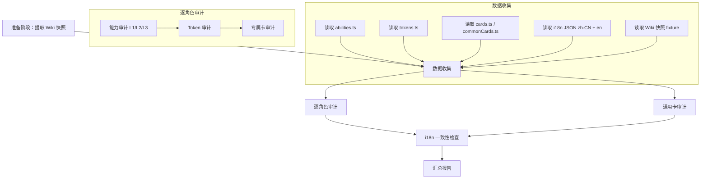
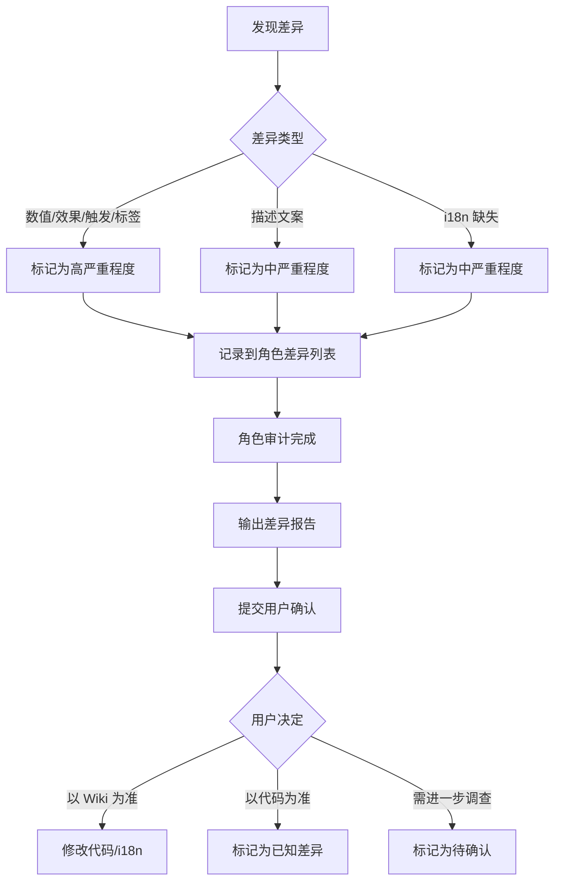

# 设计文档：王权骰铸能力与卡牌 Wiki 审计

## 概述

本设计文档描述对王权骰铸（Dice Throne, gameId: `dicethrone`）全部 6 个角色的能力（Level 1/2/3）、Token、专属卡和通用卡进行系统化 Wiki 对照审计的技术方案。

### 核心目标

- 对照官方 Wiki 描述，逐一比对每个角色的 `abilities.ts`、`tokens.ts`、`cards.ts` 和 `commonCards.ts` 中的定义
- 同时比对 i18n 描述文本（`zh-CN` 和 `en` 两个 locale）与 Wiki 的一致性
- 输出结构化的 Markdown 审计报告，按角色分组，标注差异严重程度
- 通用卡仅审计一次，不按角色重复

### 设计决策

1. **人工审计为主、自动化辅助**：由于 Wiki 数据需要人工提取（无稳定 API），审计以人工逐角色对照为主，辅以自动化测试验证代码内部一致性（如 i18n key 覆盖、effects 与 description 对齐）
2. **Wiki 数据采用离线快照**：将 Wiki 描述文本提取为本地 TypeScript fixture 文件，避免运行时网络依赖，便于版本管理和回归验证
3. **逐角色分批审计**：每个角色独立输出一份审计报告到 `.tmp/` 目录，最后汇总统计
4. **四维度比对**：每个审计对象从数值、效果、触发条件、描述文案四个维度进行比对

## 架构

### 审计流程总览



### 审计层次模型

```
┌─────────────────────────────────────────────────┐
│ Layer 1: 能力审计（AbilityDef）                   │
│   - Level 1 基础能力：trigger/variants/effects/  │
│     tags/type                                    │
│   - Level 2/3 升级能力：数值变化、新增效果、      │
│     新增 tags（如 unblockable）                   │
├─────────────────────────────────────────────────┤
│ Layer 2: Token 审计（TokenDef）                   │
│   - 效果描述、触发时机（passiveTrigger.timing）   │
│   - 效果动作（actions / activeUse）               │
│   - 叠加上限（stackLimit）、类别（category）      │
├─────────────────────────────────────────────────┤
│ Layer 3: 卡牌审计（AbilityCard）                  │
│   - 专属卡：cpCost/timing/effects/type/          │
│     playCondition                                │
│   - 通用卡：同上（仅审计一次）                    │
├─────────────────────────────────────────────────┤
│ Layer 4: i18n 描述一致性                          │
│   - en locale vs Wiki 英文描述                    │
│   - zh-CN locale vs Wiki 语义一致性               │
│   - i18n key 覆盖完整性                           │
└─────────────────────────────────────────────────┘
```

## 组件与接口

### 1. 审计数据源

#### 1.1 代码侧数据源

| 数据源 | 路径模式 | 内容 |
|--------|---------|------|
| 能力定义 | `src/games/dicethrone/heroes/<heroId>/abilities.ts` | `AbilityDef`（id, type, trigger/variants, effects, tags） |
| Token 定义 | `src/games/dicethrone/heroes/<heroId>/tokens.ts` | `TokenDef`（id, category, stackLimit, passiveTrigger, activeUse） |
| 专属卡定义 | `src/games/dicethrone/heroes/<heroId>/cards.ts` | `AbilityCard`（id, cpCost, timing, effects, type, playCondition） |
| 通用卡定义 | `src/games/dicethrone/domain/commonCards.ts` | `COMMON_CARDS: AbilityCard[]`（18 张共享卡） |
| i18n 英文 | `public/locales/en/game-dicethrone.json` | `abilities.*`, `statusEffects.*`, `cards.*` |
| i18n 中文 | `public/locales/zh-CN/game-dicethrone.json` | 同上 |

#### 1.2 Wiki 对照数据源

Wiki 描述文本以 TypeScript fixture 形式存储，结构如下：

```typescript
/** 能力 Wiki 快照 */
interface WikiAbilitySnapshot {
  heroId: string;
  abilityId: string;
  level: 1 | 2 | 3;
  wikiName: string;           // Wiki 上的英文名
  wikiDescription: string;    // Wiki 上的效果描述
  wikiDamage?: number;        // 伤害数值
  wikiHeal?: number;          // 治疗数值
  wikiStatusEffect?: string;  // 状态效果名
  wikiStatusValue?: number;   // 状态效果数值
  wikiTrigger?: string;       // 触发条件描述
  wikiTags?: string[];        // 特殊标签（unblockable 等）
}

/** Token Wiki 快照 */
interface WikiTokenSnapshot {
  heroId: string;
  tokenId: string;
  wikiName: string;
  wikiDescription: string;
  wikiTiming?: string;        // 触发时机
  wikiStackLimit?: number;
  wikiCategory?: string;      // buff/debuff/consumable
}

/** 卡牌 Wiki 快照 */
interface WikiCardSnapshot {
  cardId: string;
  heroId?: string;            // null 表示通用卡
  wikiName: string;
  wikiCpCost: number;
  wikiTiming: string;
  wikiDescription: string;
  wikiType: 'action' | 'upgrade';
}
```

### 2. 审计执行器

#### 2.1 能力审计执行器

每个角色的能力审计流程：

```
输入：heroId → 获取该角色 ABILITIES 数组 + Level 2/3 升级导出
  ↓
对每个能力（每个 level）：
  1. 读取 AbilityDef 的 trigger/variants/effects/tags
  2. 读取 Wiki 快照对应条目
  3. 比对维度：
     a. 伤害数值（effects 中 action.type === 'damage' 的 value）
     b. 治疗数值（effects 中 action.type === 'heal' 的 value）
     c. 状态效果（effects 中 action.type === 'grantStatus' 的 statusId + value）
     d. 触发条件（trigger.type + trigger.faces / variants 的 trigger）
     e. 特殊标签（tags: unblockable/ultimate 等）
     f. 效果描述文案（i18n 对照）
  4. 输出审计结果行
```

#### 2.2 Token 审计执行器

```
输入：heroId → 获取该角色 TOKENS 数组
  ↓
对每个 Token：
  1. 读取 TokenDef 的 category/stackLimit/passiveTrigger/activeUse
  2. 读取 Wiki 快照对应条目
  3. 比对维度：
     a. 名称
     b. 效果描述
     c. 触发时机（passiveTrigger.timing）
     d. 效果动作（passiveTrigger.actions / activeUse.effect）
     e. 叠加上限（stackLimit）
     f. 类别（category）
  4. 输出审计结果行
```

#### 2.3 卡牌审计执行器

```
输入：heroId → 获取该角色 CARDS 数组（含专属卡 + 通用卡引用）
  ↓
对每张专属卡（通用卡单独处理）：
  1. 读取 AbilityCard 的 cpCost/timing/effects/type/playCondition
  2. 读取 Wiki 快照对应条目
  3. 比对维度：
     a. CP 费用（cpCost）
     b. 使用时机（timing）
     c. 效果描述
     d. 效果定义（effects 中的 action 类型和数值）
     e. 卡牌类型（type: action/upgrade）
  4. 输出审计结果行
```

#### 2.4 i18n 一致性检查器

```
输入：所有审计对象的 i18n key
  ↓
1. 检查 en locale 中每个 key 是否存在
2. 检查 zh-CN locale 中每个 key 是否存在
3. 比对 en locale 描述与 Wiki 英文描述
4. 比对 zh-CN locale 描述与 Wiki 语义
5. 标记缺失的 i18n key
```

### 3. 审计输出格式

#### 3.1 角色能力审计矩阵

```markdown
| 能力名称 | ID | 等级 | 维度 | Wiki 值 | 代码值 | 状态 | 严重程度 |
|----------|-----|------|------|---------|--------|------|---------|
| Slap | slap | L1 | 伤害(3剑) | 4 | 4 | ✅ | - |
| Slap | slap | L2 | tags(4剑) | unblockable | unblockable | ✅ | - |
| Rage | rage | L1 | 伤害 | 15 | 12 | ❌ | 高 |
```

#### 3.2 Token 审计矩阵

```markdown
| Token 名称 | ID | 维度 | Wiki 值 | 代码值 | 状态 | 严重程度 |
|-----------|-----|------|---------|--------|------|---------|
| Concussion | concussion | timing | onPhaseEnter | onPhaseEnter | ✅ | - |
| Daze | daze | stackLimit | 1 | 1 | ✅ | - |
```

#### 3.3 卡牌审计矩阵

```markdown
| 卡牌名称 | ID | 维度 | Wiki 值 | 代码值 | 状态 | 严重程度 |
|----------|-----|------|---------|--------|------|---------|
| Energetic | card-energetic | cpCost | 0 | 0 | ✅ | - |
| Energetic | card-energetic | timing | main | main | ✅ | - |
```

#### 3.4 汇总统计

```markdown
## 汇总

| 角色 | 能力差异 | Token 差异 | 专属卡差异 | 总计 |
|------|---------|-----------|-----------|------|
| barbarian | 0 | 0 | 1 | 1 |
| monk | 2 | 1 | 0 | 3 |
| ... | ... | ... | ... | ... |

通用卡差异: N

按严重程度:
- 高（数值/效果/触发条件错误）: N
- 中（描述文案不一致）: N
- 低（i18n 缺失）: N
```


## 数据模型

### 审计结果数据结构

```typescript
/** 差异严重程度 */
type Severity = 'high' | 'medium' | 'low';

/** 差异类型 */
type DiscrepancyType =
  | 'value_error'           // 数值错误（伤害/治疗/CP费用等）
  | 'effect_missing'        // 效果缺失（Wiki 有但代码无）
  | 'effect_extra'          // 效果多余（代码有但 Wiki 无）
  | 'trigger_mismatch'      // 触发条件不一致
  | 'description_mismatch'  // 描述文案不一致
  | 'tag_mismatch'          // 标签不一致（unblockable 等）
  | 'i18n_missing'          // i18n key 缺失
  | 'item_missing'          // 整个能力/Token/卡牌缺失
  | 'item_extra';           // 整个能力/Token/卡牌多余

/** 单条差异记录 */
interface DiscrepancyRecord {
  heroId: string;
  /** 审计对象类型 */
  objectType: 'ability' | 'token' | 'hero_card' | 'common_card';
  /** 对象名称 */
  objectName: string;
  /** 对象 ID */
  objectId: string;
  /** 能力等级（仅 ability 类型） */
  level?: 1 | 2 | 3;
  /** 差异维度 */
  dimension: string;
  /** 差异类型 */
  type: DiscrepancyType;
  /** Wiki 值 */
  wikiValue: string;
  /** 代码值 */
  codeValue: string;
  /** 严重程度 */
  severity: Severity;
  /** 补充说明 */
  note?: string;
}

/** 角色审计结果 */
interface HeroAuditResult {
  heroId: string;
  heroName: string;
  /** 能力差异列表 */
  abilityDiscrepancies: DiscrepancyRecord[];
  /** Token 差异列表 */
  tokenDiscrepancies: DiscrepancyRecord[];
  /** 专属卡差异列表 */
  heroCardDiscrepancies: DiscrepancyRecord[];
}

/** 全局审计汇总 */
interface AuditSummary {
  /** 各角色审计结果 */
  heroResults: HeroAuditResult[];
  /** 通用卡差异列表 */
  commonCardDiscrepancies: DiscrepancyRecord[];
  /** i18n 差异列表 */
  i18nDiscrepancies: DiscrepancyRecord[];
  /** 按严重程度统计 */
  bySeverity: { high: number; medium: number; low: number };
  /** 按角色统计 */
  byHero: Record<string, number>;
}
```

### 严重程度分级规则

| 差异类型 | 严重程度 | 说明 |
|----------|---------|------|
| 数值错误（伤害/治疗/CP/stackLimit） | 高 | 直接影响游戏平衡 |
| 效果缺失/多余 | 高 | 功能不完整或多余 |
| 触发条件不一致 | 高 | 影响能力激活逻辑 |
| 标签不一致（unblockable 等） | 高 | 影响战斗机制 |
| 描述文案不一致 | 中 | 玩家看到错误信息 |
| i18n key 缺失 | 中 | 界面显示异常 |
| 整个能力/Token/卡牌缺失 | 高 | 功能未实现 |
| 整个能力/Token/卡牌多余 | 高 | 存在未定义的实现 |

### 审计比对维度详表

#### 能力（AbilityDef）比对维度

| 维度 | 代码字段 | Wiki 对照 | 说明 |
|------|---------|----------|------|
| 伤害数值 | `effects[].action.value`（type=damage） | Wiki damage 值 | 含变体各档位 |
| 治疗数值 | `effects[].action.value`（type=heal） | Wiki heal 值 | 含变体各档位 |
| 状态效果 | `effects[].action.statusId + value`（type=grantStatus） | Wiki status 描述 | 类型+数值 |
| 触发条件 | `trigger.type + trigger.faces` 或 `variants[].trigger` | Wiki dice combo | 骰面组合 |
| 特殊标签 | `tags[]` | Wiki tags | unblockable/ultimate 等 |
| 效果描述 | i18n `abilities.<id>.description` | Wiki description | 语义比对 |

#### Token（TokenDef）比对维度

| 维度 | 代码字段 | Wiki 对照 |
|------|---------|----------|
| 名称 | `name`（i18n key） | Wiki token name |
| 效果描述 | `description`（i18n key） | Wiki token description |
| 触发时机 | `passiveTrigger.timing` | Wiki timing |
| 效果动作 | `passiveTrigger.actions` / `activeUse` | Wiki effect |
| 叠加上限 | `stackLimit` | Wiki stack limit |
| 类别 | `category` | Wiki category |

#### 卡牌（AbilityCard）比对维度

| 维度 | 代码字段 | Wiki 对照 |
|------|---------|----------|
| CP 费用 | `cpCost` | Wiki CP cost |
| 使用时机 | `timing` | Wiki timing |
| 效果描述 | `description`（i18n key） | Wiki description |
| 效果定义 | `effects[].action` | Wiki effect |
| 卡牌类型 | `type` | Wiki type |


## 正确性属性

*正确性属性是在系统所有有效执行中都应成立的特征或行为——本质上是关于系统应该做什么的形式化陈述。属性是人类可读规范与机器可验证正确性保证之间的桥梁。*

### Property 1: 审计覆盖完整性

*对于任意*预定义的角色 ID（barbarian、monk、pyromancer、moon_elf、shadow_thief、paladin），审计报告中必须存在该角色的能力审计、Token 审计和专属卡审计三个部分。通用卡审计必须恰好出现一次。

**Validates: Requirements 1.1, 1.2**

### Property 2: 代码内部效果-描述一致性

*对于任意*角色的任意 AbilityDef，如果其 effects 中包含 `action.type === 'damage'` 且 `action.value === N`，则对应的 i18n 效果描述文本中必须包含数值 N。同理适用于 heal、grantStatus 等 action 类型。此属性同样适用于 TokenDef 和 AbilityCard 的 effects。

**Validates: Requirements 2.1, 3.1, 6A.1, 6B.2**

### Property 3: i18n key 覆盖完整性

*对于任意*代码中定义的能力（含 Level 1/2/3）、Token 或卡牌（专属卡+通用卡），在 `en` 和 `zh-CN` 两个 locale 的 i18n JSON 文件中必须存在对应的 name 和 description key。

**Validates: Requirements 5.1, 5.4**

### Property 4: 差异严重程度分类正确性

*对于任意*差异记录，其严重程度必须根据差异类型正确分类：数值错误、效果缺失/多余、触发条件不一致、标签不一致 → 高；描述文案不一致 → 中；i18n key 缺失 → 中。

**Validates: Requirements 4.3**

### Property 5: Wiki 快照比对完整性

*对于任意* Wiki 快照中存在的能力/Token/卡牌条目，审计报告中必须存在对应的比对结果行（✅ 一致或 ❌ 差异）。反之，*对于任意*代码中存在但 Wiki 快照中不存在的条目，审计报告中必须标记为"多余项"。

**Validates: Requirements 2.2, 2.3, 2.4, 2.5, 3.2, 3.3, 3.4, 3.5, 6A.2, 6A.3, 6A.4, 6A.5, 6A.7, 6B.3, 6B.4, 6B.5, 6B.6**

## 错误处理

### 审计过程中的错误场景

| 错误场景 | 处理方式 |
|----------|---------|
| Wiki 快照数据缺失某个能力/Token/卡牌 | 标记为 `⚠️ 无Wiki数据`，仅审计代码内部一致性和 i18n 覆盖 |
| i18n JSON 中缺少某个 key | 标记为 `❌ i18n缺失`，记录缺失的 key 路径 |
| 能力定义中 effects 为空或 undefined | 标记为 `⚠️ 无效果定义`，仅审计触发条件和标签 |
| Wiki 描述存在歧义（如数值范围而非固定值） | 记录为 `⚠️ Wiki歧义`，附注原始 Wiki 文本供人工判断 |
| 代码中使用 custom action（customActionId）无法直接提取数值 | 标记为 `⚠️ 需人工验证`，记录 customActionId 供后续检查 |
| Level 2/3 升级定义未导出或命名不规范 | 通过 grep 搜索所有导出的 AbilityDef 常量，确保不遗漏 |

### 差异处理流程



## 测试策略

### 测试框架选择

- **单元测试框架**: Vitest（项目已有配置）
- **属性测试框架**: fast-check（通过 Vitest 集成）
- **测试位置**: `src/games/dicethrone/__tests__/`

### 属性测试（Property-Based Testing）

每个正确性属性对应一个属性测试，最少运行 100 次迭代。

#### 属性测试清单

| 属性 | 测试文件 | 生成器 | 最少迭代 |
|------|---------|--------|---------|
| Property 1: 审计覆盖完整性 | `audit-coverage.property.test.ts` | 从 6 个 heroId 中随机选取 | 100 |
| Property 2: 代码内部效果-描述一致性 | `audit-effect-description.property.test.ts` | 从所有 AbilityDef/TokenDef/AbilityCard 中随机选取 | 100 |
| Property 3: i18n key 覆盖完整性 | `audit-i18n-coverage.property.test.ts` | 从所有能力/Token/卡牌 ID 中随机选取 | 100 |
| Property 4: 差异严重程度分类 | `audit-severity.property.test.ts` | 生成随机 DiscrepancyType，验证 severity 映射 | 100 |
| Property 5: Wiki 快照比对完整性 | `audit-wiki-comparison.property.test.ts` | 从 Wiki 快照条目中随机选取 | 100 |

#### 属性测试标签格式

```typescript
// Feature: dicethrone-ability-wiki-audit, Property 1: 审计覆盖完整性
// Feature: dicethrone-ability-wiki-audit, Property 2: 代码内部效果-描述一致性
// Feature: dicethrone-ability-wiki-audit, Property 3: i18n key 覆盖完整性
// Feature: dicethrone-ability-wiki-audit, Property 4: 差异严重程度分类正确性
// Feature: dicethrone-ability-wiki-audit, Property 5: Wiki 快照比对完整性
```

### 单元测试

单元测试覆盖属性测试无法覆盖的具体场景：

| 测试类型 | 测试内容 | 测试文件 |
|----------|---------|---------|
| Wiki 快照完整性 | 验证 Wiki 快照覆盖所有 6 个角色的所有能力/Token/卡牌 | `audit-wiki-snapshot-completeness.test.ts` |
| 报告格式验证 | 验证生成的 Markdown 报告包含必要的表格和汇总 | `audit-report-format.test.ts` |
| 边界条件 | 空 effects、无 variants 的能力、无 passiveTrigger 的 Token | `audit-edge-cases.test.ts` |
| 通用卡去重 | 验证通用卡审计只执行一次 | `audit-common-cards.test.ts` |

### 已有测试资产复用

项目中已有的审计相关测试可直接复用：

| 已有测试 | 覆盖范围 | 复用方式 |
|----------|---------|---------|
| `card-cross-audit.test.ts` | 卡牌 i18n key 使用、效果定义完整性 | 直接复用 |
| `entity-chain-integrity.test.ts` | i18n 契约完整性、custom action 注册 | 直接复用 |
| `card-playCondition-audit.test.ts` | 卡牌 playCondition 一致性 | 直接复用 |

### 测试执行

```bash
# 运行所有审计属性测试
npx vitest run src/games/dicethrone/__tests__/audit-*.property.test.ts

# 运行所有审计单元测试
npx vitest run src/games/dicethrone/__tests__/audit-*.test.ts
```
