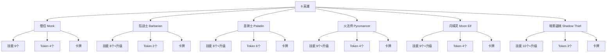

# 设计文档：DiceThrone 全链路审查

## 概述

本设计文档定义了对 DiceThrone 游戏进行全面"描述→实现全链路审查"的方法论和执行计划。审查覆盖 6 个英雄的技能、Token、卡牌、i18n 文案、执行逻辑和 UI 交互链。

审查方法遵循 AGENTS.md 中的「描述→实现全链路审查规范」：将每个机制的描述拆分为原子效果，逐效果检查定义层→执行层→状态层→验证层→UI 层→测试层六层链路，输出"原子效果 × 六层"矩阵。

## 架构

### 审查六层模型

```
定义层 (AbilityDef / TokenDef / CardDef)
    ↓
执行层 (effects.ts / customActions / executeTokens.ts / executeCards.ts)
    ↓
状态层 (reducer.ts / reduceCombat.ts / reduceCards.ts)
    ↓
验证层 (commandValidation.ts / rules.ts)
    ↓
UI 层 (TokenResponseModal / ChoiceModal / BonusDieOverlay / InteractionOverlay)
    ↓
测试层 (__tests__/*.test.ts)
```

### 审查范围



## 组件与接口

### 审查输入文件

| 英雄 | 技能定义 | Token 定义 | 卡牌定义 | CustomActions |
|------|---------|-----------|---------|---------------|
| 僧侣 | `heroes/monk/abilities.ts` | `heroes/monk/tokens.ts` | `heroes/monk/cards.ts` | `customActions/monk.ts` |
| 狂战士 | `heroes/barbarian/abilities.ts` | `heroes/barbarian/tokens.ts` | `heroes/barbarian/cards.ts` | `customActions/barbarian.ts` |
| 圣骑士 | `heroes/paladin/abilities.ts` | `heroes/paladin/tokens.ts` | `heroes/paladin/cards.ts` | `customActions/paladin.ts` |
| 火法师 | `heroes/pyromancer/abilities.ts` | `heroes/pyromancer/tokens.ts` | `heroes/pyromancer/cards.ts` | `customActions/pyromancer.ts` |
| 月精灵 | `heroes/moon_elf/abilities.ts` | `heroes/moon_elf/tokens.ts` | `heroes/moon_elf/cards.ts` | `customActions/moon_elf.ts` |
| 暗影盗贼 | `heroes/shadow_thief/abilities.ts` | `heroes/shadow_thief/tokens.ts` | `heroes/shadow_thief/cards.ts` | `customActions/shadow_thief.ts` |

### 共享执行文件

- `domain/effects.ts` — 效果解析与 customAction 注册
- `domain/execute.ts` — 命令执行器
- `domain/executeTokens.ts` — Token 命令执行
- `domain/tokenResponse.ts` — Token 响应逻辑
- `domain/flowHooks.ts` — 阶段流转与状态效果触发
- `domain/attack.ts` — 攻击结算
- `domain/executeCards.ts` — 卡牌执行
- `domain/reduceCards.ts` — 卡牌状态归约
- `domain/reduceCombat.ts` — 战斗状态归约

### i18n 文件

- `public/locales/zh-CN/game-dicethrone.json`
- `public/locales/en/game-dicethrone.json`

### UI 交互组件

- `ui/TokenResponseModal.tsx` — Token 使用弹窗
- `ui/ChoiceModal.tsx` — 选择弹窗
- `ui/BonusDieOverlay.tsx` — 奖励骰弹窗
- `ui/ConfirmRemoveKnockdownModal.tsx` — 击倒移除确认
- `ui/PurifyModal.tsx` — 净化弹窗
- `ui/InteractionOverlay.tsx` — 交互覆盖层

## 数据模型

### 审查矩阵格式

每个英雄的每个机制（技能/Token/卡牌）产出一个审查矩阵：

```
| 原子效果 | 定义层 | 执行层 | 状态层 | 验证层 | UI层 | 测试层 | 状态 |
|---------|--------|--------|--------|--------|------|--------|------|
| 造成X伤害 | ✅ | ✅ | ✅ | ✅ | ✅ | ✅ | OK |
| 获得Y Token | ✅ | ✅ | ✅ | N/A | ✅ | ❌ | 缺测试 |
```

### 问题分类

- **P0 - 逻辑错误**: 定义与执行不一致，导致游戏行为错误
- **P1 - 文案错误**: i18n 描述与实际效果不一致，误导玩家
- **P2 - 缺失实现**: 定义了效果但执行层未实现
- **P3 - 缺失测试**: 功能正确但缺少测试覆盖
- **P4 - 代码质量**: 冗余定义、不一致的命名等

## 正确性属性

*正确性属性是一种在系统所有有效执行中都应成立的特征或行为——本质上是关于系统应该做什么的形式化陈述。属性作为人类可读规范与机器可验证正确性保证之间的桥梁。*

### Property 1: 技能效果数值与 i18n 一致性
*对于任意*英雄的任意技能（包括所有升级变体），AbilityDef 中声明的 damage/heal/grantToken/grantStatus 数值应与对应 i18n 描述文本中的数值一致。
**Validates: Requirements 1.1, 1.3**

### Property 2: CustomAction 输出与 AbilityDef 声明一致性
*对于任意* customAction 处理器，其产生的事件（damage/heal/grantToken/grantStatus）的类型和数值应与引用该 customAction 的 AbilityDef 中声明的效果一致。
**Validates: Requirements 3.1**

### Property 3: 可防御性判定正确性
*对于任意*技能配置（有/无 unblockable 标签、有/无 ultimate 标签、有/无伤害效果），isDefendableAttack 函数的返回值应与规则文档 §4.3/§4.4/§7.1 一致：ultimate 返回 false，unblockable 返回 false，无伤害返回 false，其余返回 true。
**Validates: Requirements 3.3, 7.3**

### Property 4: Token 执行逻辑与定义一致性
*对于任意* consumable 类型 Token，其 activeUse.timing 应在 tokenResponse.ts 的时机检查中被正确匹配；*对于任意* debuff 类型 Token，其 passiveTrigger.timing 应在 flowHooks.ts 中有对应的处理逻辑；Token 消耗后的状态变化应与 TokenDef 配置一致。
**Validates: Requirements 4.1, 4.2, 4.3**

### Property 5: 卡牌定义与 i18n 一致性
*对于任意*英雄的任意卡牌，其 effects 数值、cpCost、playTiming 应与对应 i18n 描述一致。
**Validates: Requirements 5.1, 5.2, 5.3**

### Property 6: 阶段流转正确性
*对于任意*回合阶段转换，flowHooks.ts 中的 getNextPhase 和 onPhaseExit/onPhaseEnter 逻辑应产生与规则文档 §3 一致的阶段顺序。
**Validates: Requirements 7.1**

### Property 7: 伤害类型处理正确性
*对于任意*伤害类型（一般/不可防御/纯粹/附属/终极），effects.ts 中的伤害计算逻辑应与规则文档 §7 的伤害类型一览表一致（可防御性、可忽略性、可强化性）。
**Validates: Requirements 7.2**

### Property 8: 状态效果叠加正确性
*对于任意*状态效果，当施加数量超过 stackLimit 时，实际叠加数应被限制在 stackLimit 以内。
**Validates: Requirements 7.4**

### Property 9: 共享状态效果跨英雄一致性
*对于任意*在多个英雄间共享的状态效果（击倒、闪避），不同英雄的 TokenDef 中的关键字段（stackLimit、activeUse/passiveTrigger 配置）应完全一致。
**Validates: Requirements 8.1, 8.2**

### Property 10: 燃烧/中毒 upkeep 处理正确性
*对于任意*拥有燃烧或中毒状态的玩家，在 upkeep 阶段应受到等同层数的伤害，然后移除 1 层。
**Validates: Requirements 8.3**

### Property 11: CustomAction 测试覆盖完整性
*对于任意*已注册的 customAction 处理器 ID，测试文件中应至少存在一个引用该 ID 的测试用例。
**Validates: Requirements 9.2**

## 错误处理

### 审查发现问题的处理流程

1. **P0 逻辑错误**: 立即修复代码，补充回归测试
2. **P1 文案错误**: 修复 i18n JSON，确保中英文同步
3. **P2 缺失实现**: 在 customActions 中补充实现，添加测试
4. **P3 缺失测试**: 补充测试用例
5. **P4 代码质量**: 记录到 TODO，后续清理

### 审查中断恢复

- 每个英雄的审查结果独立记录
- 审查进度通过 tasks.md 的 checkbox 追踪
- 发现问题后先记录，批量修复

## 测试策略

### 单元测试

- 每个英雄的 customAction 处理器至少有一个测试用例
- 每个 Token 的使用/触发流程至少有一个测试用例
- 每个卡牌效果至少有一个测试用例

### 属性测试

- 使用 Vitest 的 property-based testing 能力
- 最少 100 次迭代
- 每个属性测试标注对应的设计属性编号

### 审查测试（静态审计）

- `entity-chain-integrity.test.ts` — 实体链完整性审计
- `card-cross-audit.test.ts` — 卡牌交叉审计
- 新增：`full-chain-audit.test.ts` — 全链路审查自动化测试

### 测试标注格式

```typescript
// Feature: dicethrone-full-audit, Property 1: 技能效果数值与 i18n 一致性
it.prop('ability effect values match i18n descriptions', ...);
```
