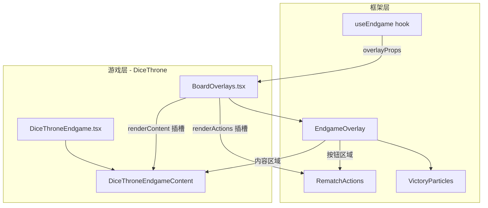
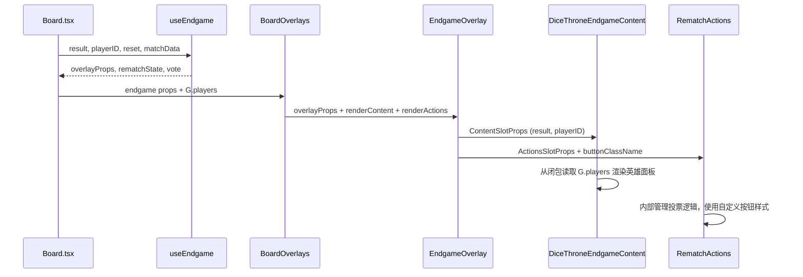

# 设计文档：王权骰铸风格结算界面

## 概述

为王权骰铸（Dice Throne）实现专属风格的结算界面，通过 `EndgameOverlay` 的 `renderContent` / `renderActions` 插槽注入自定义内容，展示英雄对决结果、战斗数据摘要和街机立体风格的操作按钮。

核心设计决策：
1. **框架层扩展优先**：为 `RematchActions` 新增 `renderButton` 插槽，使游戏层可换肤而不重写投票逻辑
2. **零逻辑重复**：游戏层仅负责视觉渲染，所有投票状态管理、模式分支逻辑留在框架层
3. **数据只读**：从 `HeroState` 读取所有展示数据（characterId、resources、tokens），不引入新的 core 状态字段
4. **复用现有工具**：`getPortraitStyle` 获取角色肖像、`useEndgame` 组装 overlay props、i18n 获取角色名称

## 架构

### 整体架构



### 数据流



## 组件与接口

### 1. RematchActions 框架层扩展

当前 `RematchActions` 硬编码了按钮样式（`HoverOverlayLabel` + 圆角胶囊），不支持游戏层换肤。需要新增 `renderButton` 插槽。

```typescript
// 新增到 RematchActionsProps
export interface RematchButtonProps {
    /** 按钮类型标识 */
    role: 'playAgain' | 'cancelVote' | 'vote' | 'backToLobby' | 'restarting';
    /** 按钮文本（已 i18n） */
    label: string;
    /** 点击回调 */
    onClick?: () => void;
    /** 是否禁用 */
    disabled?: boolean;
}

export interface RematchActionsProps {
    // ... 现有 props 不变
    /** 自定义按钮渲染插槽（可选，不传则使用默认样式） */
    renderButton?: (props: RematchButtonProps) => React.ReactNode;
}
```

设计要点：
- `renderButton` 是可选的，不传时回退到现有的 `HoverOverlayLabel` 按钮样式
- 每个按钮通过 `role` 标识其语义，游戏层可根据 role 应用不同样式
- `label` 已经过 i18n 翻译，游戏层无需再次翻译
- 投票点（voteDots）、等待提示等非按钮元素保持框架层渲染，不暴露给游戏层
- 此扩展对 SmashUp、TicTacToe 等现有游戏零影响（不传 renderButton 即可）

### 2. DiceThroneEndgameContent 组件

游戏层自定义内容区域，展示英雄对决结果面板。

```typescript
// src/games/dicethrone/ui/DiceThroneEndgame.tsx

interface DiceThroneEndgameContentProps extends ContentSlotProps {
    /** 双方玩家状态 */
    players: Record<PlayerId, HeroState>;
    /** 当前视角玩家 ID */
    myPlayerId: string | null;
    /** 当前语言 */
    locale: string;
}
```

组件职责：
- 根据 `result.winner` 和 `myPlayerId` 判断胜负视角
- 使用 `getPortraitStyle` 渲染双方英雄肖像
- 从 `HeroState.resources` 读取 HP/CP
- 从 `HeroState.tokens` 读取非零 Token 摘要
- 从 i18n `hero.{characterId}` 获取角色名称
- 使用 framer-motion 实现入场动画（弹簧缩放 + 交错延迟）

### 3. DiceThrone 风格按钮渲染函数

提供给 `RematchActions.renderButton` 的渲染函数，实现街机立体风格按钮。

```typescript
// src/games/dicethrone/ui/DiceThroneEndgame.tsx

function renderDiceThroneButton(props: RematchButtonProps): React.ReactNode {
    const isPrimary = props.role === 'playAgain' || props.role === 'vote';
    // 琥珀金主色调 vs slate 次要色
    // 立体按钮：渐变背景 + 底部阴影 + active:translate-y-0.5
    // ...
}
```

### 4. BoardOverlays 集成变更

修改 `BoardOverlays` 中的 `EndgameOverlay` 调用，注入 `renderContent` 和 `renderActions`：

```typescript
// BoardOverlays.tsx 中的 EndgameOverlay 调用变更
<EndgameOverlay
    {...existingProps}
    renderContent={(contentProps) => (
        <DiceThroneEndgameContent
            {...contentProps}
            players={props.players}
            myPlayerId={props.playerID ?? null}
            locale={props.locale}
        />
    )}
    renderActions={(actionsProps) => (
        <RematchActions
            {...actionsProps}
            renderButton={renderDiceThroneButton}
        />
    )}
/>
```

## 数据模型

### 展示数据来源（只读，不引入新字段）

| 展示内容 | 数据来源 | 路径 |
|---------|---------|------|
| 角色肖像 | Portrait Atlas | `getPortraitStyle(player.characterId, locale)` |
| 角色名称 | i18n | `t('hero.{characterId}')` |
| 最终 HP | HeroState.resources | `player.resources[RESOURCE_IDS.HP]` |
| 最终 CP | HeroState.resources | `player.resources[RESOURCE_IDS.CP]` |
| Token 摘要 | HeroState.tokens | `Object.entries(player.tokens).filter(([_, v]) => v > 0)` |
| Token 名称 | i18n | `t('tokens.{tokenId}.name')` |
| 胜负判定 | GameOverResult | `result.winner === myPlayerId` |
| 平局判定 | GameOverResult | `result.draw === true` |

### 视觉样式常量

```typescript
// 街机立体风格色彩系统
const DT_ENDGAME_STYLES = {
    // 胜利：琥珀金
    victory: {
        title: 'bg-gradient-to-r from-amber-400 to-yellow-300 bg-clip-text text-transparent',
        glow: 'drop-shadow-[0_0_20px_rgba(251,191,36,0.5)]',
    },
    // 失败：红色系
    defeat: {
        title: 'bg-gradient-to-r from-red-500 to-red-700 bg-clip-text text-transparent',
        glow: 'drop-shadow-[0_0_20px_rgba(239,68,68,0.3)]',
    },
    // 平局：白银
    draw: {
        title: 'bg-gradient-to-r from-white to-slate-300 bg-clip-text text-transparent',
        glow: 'drop-shadow-[0_0_20px_rgba(255,255,255,0.3)]',
    },
    // 面板背景
    panel: 'bg-black/80 backdrop-blur-sm rounded-2xl border border-amber-500/20',
    // 主按钮（琥珀金立体）
    primaryButton: 'bg-gradient-to-b from-amber-500 to-amber-700 shadow-[0_4px_0_0_#92400e] active:translate-y-0.5 active:shadow-[0_2px_0_0_#92400e]',
    // 次要按钮（slate 立体）
    secondaryButton: 'bg-gradient-to-b from-slate-600 to-slate-700 shadow-[0_4px_0_0_#1e293b] active:translate-y-0.5 active:shadow-[0_2px_0_0_#1e293b]',
} as const;
```

### 动画参数

```typescript
const ENDGAME_ANIMATION = {
    // 面板入场
    panel: {
        initial: { scale: 0.8, opacity: 0 },
        animate: { scale: 1, opacity: 1 },
        transition: { type: 'spring', stiffness: 300, damping: 25 },
    },
    // 英雄肖像交错入场
    portrait: {
        staggerDelay: 0.15, // 150ms
        initial: { scale: 0.5, opacity: 0, y: 20 },
        animate: { scale: 1, opacity: 1, y: 0 },
        transition: { type: 'spring', stiffness: 200, damping: 20 },
    },
    // 胜负标题
    title: {
        delay: 0.3,
        initial: { scale: 0.5, opacity: 0 },
        animate: { scale: 1, opacity: 1 },
        transition: { type: 'spring', stiffness: 300, damping: 20 },
    },
} as const;
```


## 正确性属性

*属性（Property）是在系统所有合法执行中都应成立的特征或行为——本质上是对系统应做之事的形式化陈述。属性是人类可读规格与机器可验证正确性保证之间的桥梁。*

### Property 1: 结算面板内容完整性

*For any* 游戏结束状态（包含任意两个角色 ID、任意 HP/CP 值、任意 Token 组合），渲染的结算面板应同时包含：双方英雄肖像、双方角色名称、双方最终 HP 值、双方最终 CP 值、以及所有非零 Token 的名称和数量。

**Validates: Requirements 1.1, 1.2, 1.5, 4.1, 4.2**

### Property 2: 胜负视觉区分

*For any* 存在胜者的游戏结果，胜者肖像容器的 CSS 类应与败者肖像容器的 CSS 类不同（胜者更大/更亮，败者灰暗/缩小）。*For any* 平局结果，双方肖像容器应具有相同的视觉处理。

**Validates: Requirements 1.3, 1.4**

### Property 3: 标题颜色匹配结果类型

*For any* 游戏结果和当前玩家视角，标题元素的颜色类应与结果类型匹配：胜利使用琥珀金色系（amber），失败使用红色系（red），平局使用白银色系（white/slate）。

**Validates: Requirements 2.4, 2.5, 2.6**

### Property 4: 投票逻辑零重复（P1）

*For any* `renderActions` 插槽实现的源代码，不得包含对 `myVote`、`ready`、`rematchState.votes` 的条件判断逻辑（if/else/ternary）。所有投票状态分支必须全部在框架层 `RematchActions` 内部。

**Validates: Requirements 5.2 (P1)**

### Property 5: 框架层向后兼容（P3）

*For any* 不传 `renderButton` 的 `RematchActions` 调用（即现有游戏的使用方式），渲染输出应与扩展前完全一致——相同的 DOM 结构、相同的 CSS 类、相同的交互行为。

**Validates: Requirements 6.7, 6.8 (P3)**

### Property 6: 无障碍标注正确性

*For any* 游戏结果（胜利/失败/平局），结算面板应包含语义正确的 `aria-label` 属性，准确描述当前结果。

**Validates: Requirements 7.4**

## 错误处理

| 场景 | 处理方式 |
|------|---------|
| `result` 为 undefined | EndgameOverlay 不显示（已有逻辑） |
| `players` 中缺少某个玩家 | 使用默认值渲染（HP=0, 无 Token），不崩溃 |
| `characterId` 无对应肖像索引 | `getPortraitStyle` 已有 fallback（index=0） |
| i18n key 缺失 | react-i18next 返回 key 本身，不崩溃 |
| `renderButton` 返回 null | RematchActions 正常渲染空位，不影响其他按钮 |
| Token 数据为空对象 | 不渲染 Token 摘要区域 |

## 测试策略

### 双轨测试方法

**单元测试（Vitest）**：
- 验证 `DiceThroneEndgameContent` 在各种游戏结果下的渲染输出
- 验证 `RematchActions` 新增 `renderButton` 插槽的向后兼容性
- 验证按钮渲染函数的样式输出
- 边界情况：空 Token、缺失玩家数据、未知角色 ID

**属性测试（fast-check + Vitest）**：
- 使用 `fast-check` 库生成随机游戏结束状态
- 每个属性测试最少运行 100 次迭代
- 生成器覆盖：随机角色 ID 对、随机 HP/CP 值（0-50）、随机 Token 组合、随机胜负结果
- 每个测试用注释标注对应的设计属性：`// Feature: dicethrone-game-over-screen, Property N: {title}`

**属性测试配置**：
- 库：`fast-check`（项目已有依赖或可轻量引入）
- 迭代次数：`numRuns: 100`
- 每个正确性属性对应一个属性测试
- P4（投票逻辑零重复）通过静态代码分析测试（grep 源文件），不需要 PBT

**E2E 测试（Playwright）**：
- 通过 TestHarness 注入游戏结束状态，验证结算界面完整渲染
- 验证操作按钮的点击交互（投票、返回大厅）
- 验证入场动画播放（截图对比）
