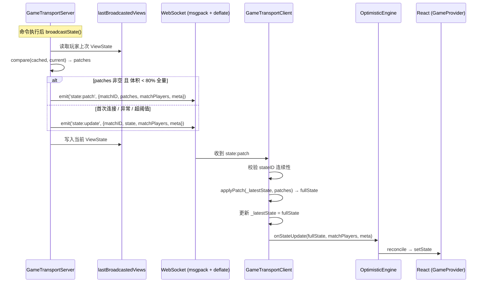
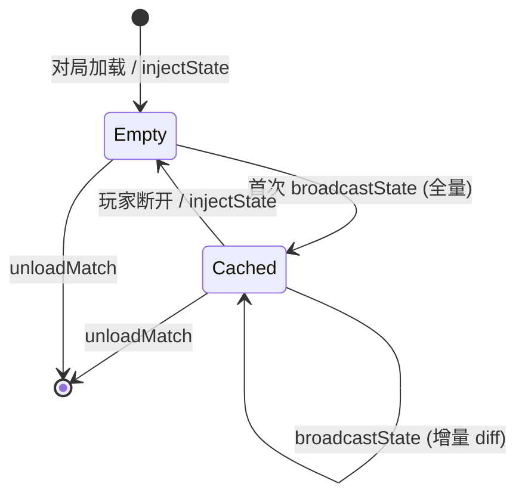

# 技术设计文档：增量状态同步 (Incremental State Sync)

## 概述

本设计在现有全量状态同步（`state:update`）基础上，引入基于 JSON Patch (RFC 6902) 的增量同步机制。服务端为每个玩家/旁观者缓存上一次广播的 ViewState，使用 `fast-json-patch` 库计算 diff，通过新增的 `state:patch` 事件仅推送变更部分。客户端接收 patch 后还原完整状态，透明地传递给现有的 `onStateUpdate` → 乐观引擎 → React 状态链路。

核心设计决策：
- **透明集成**：增量同步对乐观引擎和 React 层完全透明——客户端在 `GameTransportClient` 内部完成 patch → 完整状态的还原，上层消费者始终收到完整状态
- **可靠回退**：任何异常（diff 计算失败、patch 体积超阈值、客户端应用失败、stateID 不连续）均自动回退到全量同步
- **零配置**：利用现有 msgpack 序列化 + perMessageDeflate 帧压缩，无需额外传输层配置
- **面向百游戏**：方案在引擎传输层实现，对所有游戏透明生效，游戏层零代码

## 架构

### 数据流概览



### 缓存生命周期



### 变更范围

本功能仅修改引擎传输层，不涉及游戏层、领域层或 UI 层：

| 文件 | 变更类型 | 说明 |
|------|----------|------|
| `src/engine/transport/server.ts` | 修改 | ActiveMatch 新增缓存字段，broadcastState 增加 diff 逻辑 |
| `src/engine/transport/client.ts` | 修改 | 新增 `state:patch` 监听、stateID 校验、patch 应用 |
| `src/engine/transport/protocol.ts` | 修改 | ServerToClientEvents 新增 `state:patch` 类型定义 |
| `src/engine/transport/patch.ts` | 新增 | diff 计算、patch 应用、体积比较的纯函数封装 |
| `package.json` | 修改 | 新增 `fast-json-patch` 依赖 |


## 组件与接口

### 1. Patch 工具模块 (`src/engine/transport/patch.ts`)

新增纯函数模块，封装所有 diff/patch 逻辑，便于单元测试和复用：

```typescript
import { compare, applyPatch as fjpApplyPatch, type Operation } from 'fast-json-patch';

/** Diff 计算结果 */
export interface DiffResult {
  /** 'patch' = 增量可用, 'full' = 需要全量回退 */
  type: 'patch' | 'full';
  /** JSON Patch 操作数组（仅 type='patch' 时有值） */
  patches?: Operation[];
  /** 回退原因（仅 type='full' 时有值） */
  fallbackReason?: string;
}

/**
 * 计算两个 ViewState 之间的 JSON Patch diff
 * 
 * @param oldState 上次广播的 ViewState（缓存）
 * @param newState 当前 ViewState
 * @param sizeThreshold patch 体积占全量比例阈值（默认 0.8）
 * @returns DiffResult
 */
export function computeDiff(
  oldState: unknown,
  newState: unknown,
  sizeThreshold = 0.8,
): DiffResult {
  try {
    const patches = compare(oldState as object, newState as object);
    
    // 空 patch = 状态未变化
    if (patches.length === 0) {
      return { type: 'patch', patches: [] };
    }
    
    // 体积比较：patch 序列化体积 vs 全量序列化体积
    const patchSize = JSON.stringify(patches).length;
    const fullSize = JSON.stringify(newState).length;
    
    if (patchSize >= fullSize * sizeThreshold) {
      return { type: 'full', fallbackReason: `patch_size_ratio=${(patchSize / fullSize).toFixed(2)}` };
    }
    
    return { type: 'patch', patches };
  } catch (error) {
    return { type: 'full', fallbackReason: `diff_error: ${(error as Error).message}` };
  }
}

/** Patch 应用结果 */
export interface ApplyResult {
  success: boolean;
  state?: unknown;
  error?: string;
}

/**
 * 将 JSON Patch 应用到基础状态上
 * 
 * @param baseState 当前本地缓存状态
 * @param patches JSON Patch 操作数组
 * @returns ApplyResult
 */
export function applyPatches(baseState: unknown, patches: Operation[]): ApplyResult {
  try {
    // 深拷贝基础状态，避免 applyPatch 的 in-place 修改影响原始引用
    const cloned = JSON.parse(JSON.stringify(baseState));
    const result = fjpApplyPatch(cloned, patches, /* validate */ true);
    
    // 检查是否有操作失败
    const hasError = result.some(r => r !== null && typeof r === 'object' && 'message' in r);
    if (hasError) {
      return { success: false, error: 'patch_validation_failed' };
    }
    
    return { success: true, state: cloned };
  } catch (error) {
    return { success: false, error: (error as Error).message };
  }
}
```

### 2. 协议扩展 (`src/engine/transport/protocol.ts`)

在 `ServerToClientEvents` 中新增 `state:patch` 事件定义：

```typescript
export interface ServerToClientEvents {
  // ... 现有事件保持不变 ...

  /** 增量状态更新（JSON Patch） */
  'state:patch': (
    matchID: string,
    patches: import('fast-json-patch').Operation[],
    matchPlayers: MatchPlayerInfo[],
    meta: { stateID: number; lastCommandPlayerId?: string; randomCursor: number },
  ) => void;
}
```

### 3. 服务端变更 (`src/engine/transport/server.ts`)

#### ActiveMatch 接口扩展

```typescript
interface ActiveMatch {
  // ... 现有字段 ...
  
  /** 每个玩家/旁观者上次广播的 ViewState 缓存，用于 diff 计算 */
  lastBroadcastedViews: Map<string, unknown>;
}
```

#### broadcastState 方法重构

```typescript
private broadcastState(match: ActiveMatch): void {
  const nsp = this.io.of('/game');
  const matchPlayers = this.buildMatchPlayers(match);
  const meta = {
    stateID: match.stateID,
    randomCursor: match.getRandomCursor(),
    ...(match.lastCommandPlayerId && { lastCommandPlayerId: match.lastCommandPlayerId }),
  };

  // 玩家广播
  for (const [playerID, sockets] of match.connections) {
    const viewState = this.stripStateForTransport(this.applyPlayerView(match, playerID));
    this.emitStateToSockets(nsp, sockets, match, playerID, viewState, matchPlayers, meta);
  }

  // 旁观者广播
  if (match.spectatorSockets.size > 0) {
    const spectatorView = this.stripStateForTransport(this.applyPlayerView(match, null));
    this.emitStateToSockets(nsp, match.spectatorSockets, match, 'spectator', spectatorView, matchPlayers, meta);
  }
}

/**
 * 对单个玩家/旁观者执行 diff 并推送（增量或全量）
 */
private emitStateToSockets(
  nsp: Namespace,
  sockets: Set<string>,
  match: ActiveMatch,
  cacheKey: string,
  viewState: unknown,
  matchPlayers: MatchPlayerInfo[],
  meta: { stateID: number; lastCommandPlayerId?: string; randomCursor: number },
): void {
  const cached = match.lastBroadcastedViews.get(cacheKey);
  
  if (cached === undefined) {
    // 无缓存 → 全量推送
    for (const sid of sockets) {
      nsp.to(sid).emit('state:update', match.matchID, viewState, matchPlayers, meta);
    }
  } else {
    const diff = computeDiff(cached, viewState);
    
    if (diff.type === 'patch' && diff.patches && diff.patches.length > 0) {
      // 增量推送
      for (const sid of sockets) {
        nsp.to(sid).emit('state:patch', match.matchID, diff.patches, matchPlayers, meta);
      }
    } else if (diff.type === 'full') {
      // 回退全量
      logger.warn('[IncrementalSync] fallback to full sync', {
        matchID: match.matchID,
        cacheKey,
        reason: diff.fallbackReason,
      });
      for (const sid of sockets) {
        nsp.to(sid).emit('state:update', match.matchID, viewState, matchPlayers, meta);
      }
    }
    // diff.patches.length === 0 → 状态未变化，跳过推送
  }
  
  // 始终更新缓存
  match.lastBroadcastedViews.set(cacheKey, viewState);
}
```

#### 缓存生命周期管理

- **loadMatch / setupMatch**：初始化 `lastBroadcastedViews = new Map()`
- **handleSync**：发送 `state:sync` 后，将 ViewState 写入缓存（确保后续 diff 基准正确）
- **onPlayerFullyDisconnected**：从缓存中删除该玩家条目
- **unloadMatch**：随 `activeMatches.delete()` 自动清理（Map 随对象 GC）
- **injectState**：调用 `match.lastBroadcastedViews.clear()` 清空所有缓存

### 4. 客户端变更 (`src/engine/transport/client.ts`)

#### 新增字段

```typescript
class GameTransportClient {
  // ... 现有字段 ...
  
  /** 最近一次成功处理的 stateID，用于连续性校验 */
  private _lastReceivedStateID: number | null = null;
}
```

#### state:patch 监听

在 `connect()` 方法中新增：

```typescript
socket.on('state:patch', (matchID, patches, matchPlayers, meta) => {
  if (this._destroyed || matchID !== this.config.matchID) return;
  
  // stateID 连续性校验
  if (this._lastReceivedStateID !== null && meta.stateID !== this._lastReceivedStateID + 1) {
    console.warn('[GameTransportClient] stateID 不连续，请求 resync', {
      matchID,
      expected: this._lastReceivedStateID + 1,
      received: meta.stateID,
    });
    this.sendSync();
    return;
  }
  
  // 应用 patch
  if (this._latestState === null) {
    // 无基础状态，请求全量同步
    console.warn('[GameTransportClient] 收到 patch 但无基础状态，请求 resync', { matchID });
    this.sendSync();
    return;
  }
  
  const result = applyPatches(this._latestState, patches);
  
  if (!result.success) {
    console.warn('[GameTransportClient] patch 应用失败，请求 resync', {
      matchID,
      error: result.error,
    });
    this.sendSync();
    return;
  }
  
  // 更新本地状态和 stateID
  this._latestState = result.state;
  this._lastReceivedStateID = meta.stateID;
  this._matchPlayers = matchPlayers;
  
  // 传递给上层，与 state:update 行为一致
  this.config.onStateUpdate?.(result.state!, matchPlayers, meta);
});
```

#### 全量事件的 stateID 同步

在 `state:sync` 和 `state:update` 处理中更新 `_lastReceivedStateID`：

```typescript
socket.on('state:sync', (matchID, state, matchPlayers, randomMeta) => {
  // ... 现有逻辑 ...
  this._lastReceivedStateID = null; // sync 后重置，下次 patch 不校验连续性
  // 注意：state:sync 不携带 stateID，由后续 state:update/state:patch 建立基线
});

socket.on('state:update', (matchID, state, matchPlayers, meta) => {
  // ... 现有逻辑 ...
  if (meta?.stateID !== undefined) {
    this._lastReceivedStateID = meta.stateID;
  }
});
```

#### 乐观引擎回滚后的缓存同步

在 `GameProvider` 的 `onStateUpdate` 回调中，当乐观引擎发生回滚时，需要将回滚后的权威状态回写到 `_latestState`：

```typescript
// GameProvider onStateUpdate 回调中
if (engine) {
  const result = engine.reconcile(newState, meta);
  if (result.didRollback) {
    // 回滚后，用权威状态更新 client 的本地缓存
    // 确保后续 patch 应用基准正确
    const client = clientRef.current;
    if (client) {
      (client as { _latestState: unknown })._latestState = newState;
    }
  }
}
```

> **设计决策**：这里直接访问 `_latestState` 不够优雅。更好的方案是在 `GameTransportClient` 上暴露一个 `updateLatestState(state)` 方法，供 GameProvider 在回滚时调用。这保持了封装性，同时解决了 patch 基准漂移问题。


## 数据模型

### 服务端缓存结构

```typescript
// ActiveMatch 扩展
interface ActiveMatch {
  // ... 现有字段 ...
  
  /**
   * 每个玩家/旁观者上次广播的 ViewState 缓存
   * 
   * key: playerID（如 '0', '1'）或 'spectator'
   * value: 经 playerView + stripStateForTransport 处理后的 ViewState 对象
   * 
   * 生命周期：
   * - 创建：首次 broadcastState 或 handleSync 时写入
   * - 更新：每次 broadcastState 后覆盖
   * - 删除：玩家断开 / injectState 清空 / unloadMatch 销毁
   */
  lastBroadcastedViews: Map<string, unknown>;
}
```

### state:patch 事件 Payload

```typescript
/** state:patch 事件的完整 payload 结构 */
interface StatePatchPayload {
  /** 对局 ID */
  matchID: string;
  
  /** JSON Patch 操作数组（RFC 6902） */
  patches: Array<{
    op: 'add' | 'remove' | 'replace' | 'move' | 'copy' | 'test';
    path: string;       // JSON Pointer (RFC 6901)
    value?: unknown;     // add/replace/test 时必需
    from?: string;       // move/copy 时必需
  }>;
  
  /** 对局玩家信息 */
  matchPlayers: MatchPlayerInfo[];
  
  /** 元数据（与 state:update 的 meta 结构一致） */
  meta: {
    stateID: number;
    lastCommandPlayerId?: string;
    randomCursor: number;
  };
}
```

### 客户端状态扩展

```typescript
class GameTransportClient {
  // 现有字段
  private _latestState: unknown = null;        // patch 应用的基础状态
  private _matchPlayers: MatchPlayerInfo[] = [];
  
  // 新增字段
  private _lastReceivedStateID: number | null = null;  // stateID 连续性校验
}
```

### 状态转换矩阵

| 事件 | _latestState | _lastReceivedStateID | 行为 |
|------|-------------|---------------------|------|
| `state:sync` | 替换为全量 | 重置为 null | 初始同步/重连 |
| `state:update` | 替换为全量 | 更新为 meta.stateID | 全量回退/批次确认 |
| `state:patch` (校验通过) | applyPatch 后替换 | 更新为 meta.stateID | 正常增量同步 |
| `state:patch` (校验失败) | 不变 | 不变 | 丢弃 + 请求 resync |
| `state:patch` (应用失败) | 不变 | 不变 | 丢弃 + 请求 resync |
| 乐观引擎回滚 | 回写为权威状态 | 不变 | 修正 patch 基准 |

