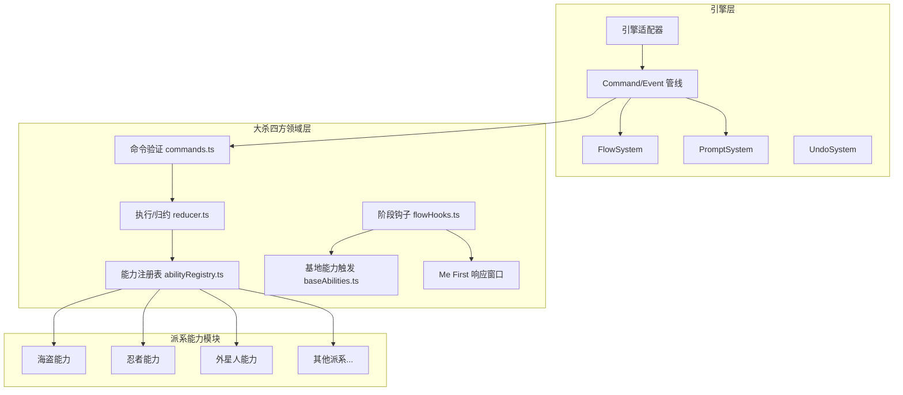

# 设计文档：大杀四方核心能力实现

## 概述

本设计基于已有的大杀四方游戏骨架（Command/Event/Reducer 架构、FlowSystem 阶段管理、17 派系卡牌数据、44 张基地卡），补全 10 个核心缺口。设计遵循引擎层的 DomainCore 模式，所有游戏逻辑通过 Command → Event → Reduce 管线执行，交互选择通过 PromptSystem 实现。

核心设计决策：
1. **能力注册表模式**：每个派系独立注册能力执行函数，通过 defId 查找，而非在 reducer 中硬编码 switch-case
2. **PromptSystem 集成**：目标选择统一走引擎层 PromptSystem，能力执行在 prompt 解决后通过事件驱动继续
3. **分阶段交付**：A 阶段（框架+核心机制）→ B 阶段（8 基础派系）→ C 阶段（高级机制+扩展派系）→ D 阶段（测试+打磨）

## 架构

### 整体架构



### 文件结构

```
src/games/smashup/
├── domain/
│   ├── types.ts              # 类型定义（已有，需扩展）
│   ├── ids.ts                # ID 常量（已有，需扩展）
│   ├── commands.ts           # 命令验证（已有，需扩展）
│   ├── reducer.ts            # 执行/归约（已有，需重构）
│   ├── index.ts              # 领域内核组装（已有，需扩展）
│   ├── abilityRegistry.ts    # 【新增】能力注册表
│   ├── abilityHelpers.ts     # 【新增】能力执行辅助函数
│   ├── baseAbilities.ts      # 【新增】基地能力触发逻辑
│   └── meFirst.ts            # 【新增】Me First 响应窗口
├── abilities/                 # 【新增】派系能力实现
│   ├── pirates.ts
│   ├── ninjas.ts
│   ├── aliens.ts
│   ├── dinosaurs.ts
│   ├── robots.ts
│   ├── wizards.ts
│   ├── zombies.ts
│   ├── tricksters.ts
│   ├── ghosts.ts
│   ├── bear_cavalry.ts
│   ├── steampunks.ts
│   ├── killer_plants.ts
│   ├── cthulhu.ts
│   ├── elder_things.ts
│   ├── innsmouth.ts
│   └── miskatonic.ts
├── __tests__/
│   ├── smashup.smoke.test.ts # 已有
│   ├── abilityRegistry.test.ts
│   ├── baseScoring.test.ts
│   ├── factionSelection.test.ts
│   ├── pirates.test.ts
│   ├── ninjas.test.ts
│   └── ...
```

## 组件与接口

### 1. 能力注册表 (abilityRegistry.ts)

核心设计：以 defId 为键的函数注册表，支持按 AbilityTag 分发。

```typescript
/** 能力执行上下文 */
interface AbilityContext {
  state: MatchState<SmashUpCore>;
  playerId: PlayerId;
  cardUid: string;
  defId: string;
  baseIndex: number;          // 随从所在基地 / 行动卡目标基地
  targetMinionUid?: string;   // 行动卡目标随从
  random: RandomFn;
  now: number;
}

/** 能力执行结果 */
interface AbilityResult {
  events: SmashUpEvent[];
  /** 需要 Prompt 时返回 prompt 配置 */
  prompt?: PromptConfig;
}

/** Prompt 配置 */
interface PromptConfig {
  id: string;
  playerId: PlayerId;
  title: string;
  options: PromptOption[];
  sourceId: string;
}

/** 能力执行函数签名 */
type AbilityExecutor = (ctx: AbilityContext) => AbilityResult;

/** 注册表 API */
const abilityRegistry = {
  register(defId: string, tag: AbilityTag, executor: AbilityExecutor): void;
  resolve(defId: string, tag: AbilityTag): AbilityExecutor | undefined;
  resolveOnPlay(defId: string): AbilityExecutor | undefined;
  resolveTalent(defId: string): AbilityExecutor | undefined;
  resolveSpecial(defId: string): AbilityExecutor | undefined;
};
```

每个派系文件导出一个 `registerXxxAbilities()` 函数，在游戏初始化时调用。

### 2. 行动卡效果执行 (reducer.ts 扩展)

当前 `PLAY_ACTION` 命令仅消耗卡牌。扩展后：

```typescript
// execute 中 PLAY_ACTION 分支
case SU_COMMANDS.PLAY_ACTION: {
  const def = getCardDef(card.defId) as ActionCardDef;
  const events: SmashUpEvent[] = [actionPlayedEvent];

  if (def.subtype === 'standard') {
    // 查找注册的效果执行器
    const executor = abilityRegistry.resolve(card.defId, 'onPlay');
    if (executor) {
      const result = executor(ctx);
      events.push(...result.events);
      // 如果需要 prompt，生成 PROMPT_CREATED 事件
    }
    // standard 行动卡进弃牌堆（由 ACTION_PLAYED reduce 处理）
  } else if (def.subtype === 'ongoing') {
    // 生成 ONGOING_ATTACHED 事件（附着到基地/随从）
    events.push(ongoingAttachedEvent);
  } else if (def.subtype === 'special') {
    // 仅在 Me First 窗口中打出，效果同 standard
    const executor = abilityRegistry.resolve(card.defId, 'special');
    if (executor) {
      const result = executor(ctx);
      events.push(...result.events);
    }
  }
  return events;
}
```

### 3. 基地能力触发 (baseAbilities.ts)

基地能力按触发时机分类：

```typescript
type BaseTriggerTiming =
  | 'onMinionPlayed'    // 随从入场时
  | 'beforeScoring'     // 记分前
  | 'afterScoring'      // 记分后
  | 'onTurnStart'       // 回合开始时
  | 'onActionPlayed';   // 行动卡打出时

/** 基地能力执行器注册表（按 baseDefId 索引） */
const baseAbilityRegistry = new Map<string, Map<BaseTriggerTiming, BaseAbilityExecutor>>();

/** 在 FlowHooks 的 onPhaseEnter/onPhaseExit 中调用 */
function triggerBaseAbilities(
  timing: BaseTriggerTiming,
  state: MatchState<SmashUpCore>,
  context: { baseIndex: number; playerId: PlayerId; ... }
): SmashUpEvent[];
```

### 4. 派系选择系统

通过新增 `factionSelect` 阶段实现，在 FlowSystem 的 `initialPhase` 之前。

```typescript
// 新增命令
SU_COMMANDS.SELECT_FACTION = 'su:select_faction';

// 新增事件
SU_EVENTS.FACTION_SELECTED = 'su:faction_selected';
SU_EVENTS.ALL_FACTIONS_SELECTED = 'su:all_factions_selected';

// SmashUpCore 扩展
interface SmashUpCore {
  // ... 已有字段
  /** 派系选择阶段状态 */
  factionSelection?: {
    /** 已被选择的派系 */
    takenFactions: string[];
    /** 每位玩家已选的派系 */
    playerSelections: Record<PlayerId, string[]>;
    /** 选择完成的玩家 */
    completedPlayers: PlayerId[];
  };
}
```

选择流程：
1. `initialPhase` 设为 `'factionSelect'`
2. 每位玩家依次通过 `SELECT_FACTION` 命令选择派系
3. 当所有玩家选完 2 个派系后，触发 `ALL_FACTIONS_SELECTED` 事件
4. `ALL_FACTIONS_SELECTED` 的 reduce 中构建牌库、抽起始手牌
5. FlowHooks 的 `onAutoContinueCheck` 检测到选择完成后自动推进到 `playCards`

### 5. +1 力量指示物

新增命令和事件：

```typescript
SU_COMMANDS.ADD_POWER_COUNTER = 'su:add_power_counter';
SU_COMMANDS.REMOVE_POWER_COUNTER = 'su:remove_power_counter';

SU_EVENTS.POWER_COUNTER_ADDED = 'su:power_counter_added';
SU_EVENTS.POWER_COUNTER_REMOVED = 'su:power_counter_removed';
```

这些命令由能力执行器在 execute 阶段生成对应事件，reduce 中修改 `MinionOnBase.powerModifier`。随从离场时（BASE_SCORED reduce、MINION_RETURNED reduce）自动清零 powerModifier。

### 6. 多基地记分

重构 FlowHooks 的 `onPhaseEnter('scoreBases')` 逻辑：

```typescript
// 当前实现：只处理第一个达到临界点的基地
// 新实现：
if (to === 'scoreBases') {
  const eligibleBases = findEligibleBases(core);
  if (eligibleBases.length === 0) return [];
  if (eligibleBases.length === 1) {
    return scoreBase(eligibleBases[0], ...);
  }
  // 多基地：通过 PromptSystem 让当前玩家选择顺序
  return [createPromptForBaseSelection(eligibleBases, pid)];
}
```

记分完成后重新检查是否有新的基地达到临界点（循环直到无基地需要记分）。

### 7. Me First 响应窗口 (meFirst.ts)

利用引擎层已有的 `ResponseWindowState` 或自建轻量级响应队列：

```typescript
interface MeFirstState {
  active: boolean;
  triggerEvent: string;       // 触发事件类型
  responderQueue: PlayerId[]; // 顺时针玩家队列
  currentIndex: number;
  passedPlayers: Set<PlayerId>;
  consecutivePasses: number;
}

// 新增命令
SU_COMMANDS.ME_FIRST_PLAY = 'su:me_first_play';
SU_COMMANDS.ME_FIRST_PASS = 'su:me_first_pass';

// 新增事件
SU_EVENTS.ME_FIRST_OPENED = 'su:me_first_opened';
SU_EVENTS.ME_FIRST_CLOSED = 'su:me_first_closed';
```

触发时机：基地记分前。从当前玩家开始顺时针轮流，每人可打 1 张 special 行动卡或让过。所有人连续让过则关闭窗口。

### 8. 持续行动管理

`ongoing` 行动卡打出时不进弃牌堆，而是附着到目标：

```typescript
SU_EVENTS.ONGOING_ATTACHED = 'su:ongoing_attached';
SU_EVENTS.ONGOING_DETACHED = 'su:ongoing_detached';

// reduce ONGOING_ATTACHED：
// - 如果目标是基地：加入 BaseInPlay.ongoingActions
// - 如果目标是随从：加入 MinionOnBase.attachedActions

// 清理时机：
// - BASE_SCORED reduce 中：清理该基地的 ongoingActions
// - 随从离场时：清理 attachedActions
```

## 数据模型

### SmashUpCore 扩展

```typescript
interface SmashUpCore {
  // === 已有字段 ===
  players: Record<PlayerId, PlayerState>;
  turnOrder: PlayerId[];
  currentPlayerIndex: number;
  bases: BaseInPlay[];
  baseDeck: string[];
  turnNumber: number;
  nextUid: number;
  gameResult?: GameOverResult;

  // === 新增字段 ===
  /** 派系选择阶段状态（选择完成后置为 undefined） */
  factionSelection?: FactionSelectionState;
  /** Me First 响应窗口状态 */
  meFirstWindow?: MeFirstState;
  /** 疯狂牌库（克苏鲁扩展，defId 列表） */
  madnessDeck?: string[];
}

interface FactionSelectionState {
  takenFactions: string[];
  playerSelections: Record<PlayerId, string[]>;
  completedPlayers: PlayerId[];
}

interface MeFirstState {
  active: boolean;
  triggerContext: string;
  responderQueue: PlayerId[];
  currentIndex: number;
  consecutivePasses: number;
}
```

### 新增命令类型

```typescript
const SU_COMMANDS = {
  // === 已有 ===
  PLAY_MINION, PLAY_ACTION, DISCARD_TO_LIMIT,
  // === 新增 ===
  SELECT_FACTION: 'su:select_faction',
  USE_TALENT: 'su:use_talent',
  ADD_POWER_COUNTER: 'su:add_power_counter',
  REMOVE_POWER_COUNTER: 'su:remove_power_counter',
  ME_FIRST_PLAY: 'su:me_first_play',
  ME_FIRST_PASS: 'su:me_first_pass',
  SELECT_SCORING_BASE: 'su:select_scoring_base',
} as const;
```

### 新增事件类型

```typescript
const SU_EVENTS = {
  // === 已有 ===
  MINION_PLAYED, ACTION_PLAYED, BASE_SCORED, VP_AWARDED,
  CARDS_DRAWN, CARDS_DISCARDED, TURN_STARTED, TURN_ENDED,
  BASE_REPLACED, DECK_RESHUFFLED, MINION_RETURNED, LIMIT_MODIFIED,
  // === 新增 ===
  FACTION_SELECTED: 'su:faction_selected',
  ALL_FACTIONS_SELECTED: 'su:all_factions_selected',
  TALENT_USED: 'su:talent_used',
  POWER_COUNTER_ADDED: 'su:power_counter_added',
  POWER_COUNTER_REMOVED: 'su:power_counter_removed',
  MINION_DESTROYED: 'su:minion_destroyed',
  MINION_MOVED: 'su:minion_moved',
  ONGOING_ATTACHED: 'su:ongoing_attached',
  ONGOING_DETACHED: 'su:ongoing_detached',
  ME_FIRST_OPENED: 'su:me_first_opened',
  ME_FIRST_CLOSED: 'su:me_first_closed',
  MADNESS_DRAWN: 'su:madness_drawn',
  MADNESS_RETURNED: 'su:madness_returned',
} as const;
```


## 正确性属性

*正确性属性是一种在系统所有合法执行中都应成立的特征或行为——本质上是关于系统应该做什么的形式化陈述。属性是人类可读规范与机器可验证正确性保证之间的桥梁。*

以下属性基于需求文档中的验收标准推导，经过冗余消除后保留 19 个独立属性。

### Property 1: 派系互斥选择

*For any* 两位玩家和任意派系，如果玩家 A 已选择该派系，则玩家 B 尝试选择同一派系的命令应被拒绝，且游戏状态不变。

**Validates: Requirements 1.3, 1.6**

### Property 2: 牌库构建正确性

*For any* 合法的两个派系组合，构建的牌库应恰好包含 40 张卡牌，且每张卡牌的 faction 属于所选的两个派系之一。

**Validates: Requirements 1.4**

### Property 3: 选择完成后初始化

*For any* 所有玩家完成派系选择后的游戏状态，每位玩家应有 5 张手牌，场上应有（玩家数+1）张基地，游戏阶段应推进到 playCards。

**Validates: Requirements 1.5**

### Property 4: 能力注册表往返一致性

*For any* defId 和 AbilityTag，注册一个能力执行函数后，通过相同的 defId 和 tag 解析应返回同一个执行函数；未注册的 defId 解析应返回 undefined。

**Validates: Requirements 2.1, 2.5, 2.6**

### Property 5: onPlay 能力触发

*For any* 带有 onPlay 标签的随从卡，将其打出到基地后，execute 产生的事件序列中应包含该随从注册的 onPlay 能力所产生的事件。

**Validates: Requirements 2.2**

### Property 6: 天赋每回合一次

*For any* 带有 talent 标签的随从，在同一回合内第一次使用天赋应成功（talentUsed 变为 true），第二次使用应被验证拒绝。新回合开始后 talentUsed 应重置为 false。

**Validates: Requirements 2.3**

### Property 7: 目标选择提示匹配合法目标

*For any* 需要选择目标的能力（随从/基地/手牌），生成的 Prompt 选项集合应与当前游戏状态下的合法目标集合完全一致（不多不少）。

**Validates: Requirements 2.4, 6.1, 6.2, 6.3, 6.4, 6.6**

### Property 8: 标准行动卡生命周期

*For any* standard 子类型的行动卡，打出后该卡牌应从手牌移入拥有者弃牌堆，且 actionsPlayed 增加 1。

**Validates: Requirements 3.1**

### Property 9: 持续行动卡附着

*For any* ongoing 子类型的行动卡，打出后该卡牌应出现在目标基地的 ongoingActions 或目标随从的 attachedActions 中，且不在任何玩家的弃牌堆中。

**Validates: Requirements 3.2**

### Property 10: 特殊行动卡生命周期

*For any* special 子类型的行动卡在 Me First 窗口中打出后，该卡牌应从手牌移入拥有者弃牌堆，且效果事件应被产生。

**Validates: Requirements 3.3**

### Property 11: 基地记分时持续行动清理

*For any* 带有 ongoingActions 的基地，记分完成后该基地的所有持续行动卡应移入各自拥有者的弃牌堆，且新补充的基地的 ongoingActions 应为空。

**Validates: Requirements 3.4**

### Property 12: 随从离场时附着行动清理

*For any* 带有 attachedActions 的随从，当该随从离场（被消灭、收回手牌、洗入牌库）后，其附着的行动卡应移入各自拥有者的弃牌堆。

**Validates: Requirements 3.5**

### Property 13: 力量指示物不变量

*For any* 随从和任意序列的添加/移除指示物操作，powerModifier 始终 >= 0；添加 N 个指示物使 powerModifier 增加 N；移除 N 个指示物使 powerModifier 减少 min(N, 当前值)；随从离场后 powerModifier 归零。基地总力量始终等于所有随从的 (basePower + powerModifier) 之和。

**Validates: Requirements 4.1, 4.2, 4.3, 4.4**

### Property 14: 多基地记分提示

*For any* 记分阶段有 2 个或以上基地达到临界点的游戏状态，系统应通过 PromptSystem 让当前玩家选择记分顺序，而非自动选择。

**Validates: Requirements 5.1**

### Property 15: 记分循环完整性

*For any* 记分阶段，所有达到临界点的基地最终都应被记分（除非记分过程中力量变化导致不再达标）。每次记分后应重新检查剩余基地。

**Validates: Requirements 5.2, 5.3**

### Property 16: VP 分配正确性

*For any* 基地记分，若只有一位玩家有随从则该玩家获得第一名 VP；若多位玩家力量相同则平局玩家均获得该名次最高 VP。无随从或零力量的玩家不获得 VP。

**Validates: Requirements 5.4, 5.5**

### Property 17: 基地能力事件顺序

*For any* 有能力的基地，onMinionPlayed 能力事件应出现在 MINION_PLAYED 事件之后；beforeScoring 能力事件应出现在 VP_AWARDED 之前；afterScoring 能力事件应出现在 BASE_SCORED 之后清场之前；onTurnStart 能力事件应出现在 TURN_STARTED 之后。

**Validates: Requirements 8.1, 8.2, 8.3, 8.4, 8.5**

### Property 18: Me First 窗口协议

*For any* Me First 响应窗口，响应者应从当前玩家开始顺时针排列；每位响应者仅可打出 special 行动卡或让过；所有玩家连续让过时窗口关闭；任何玩家打出特殊牌后连续让过计数重置。

**Validates: Requirements 9.1, 9.2, 9.3, 9.4, 9.5**

### Property 19: 疯狂牌库生命周期

*For any* 使用克苏鲁扩展的游戏，疯狂牌库初始包含 30 张牌；抽取 N 张疯狂牌使牌库减少 N 且玩家手牌增加 N；疯狂牌离场进入控制者弃牌堆而非返回牌库；游戏结束时每位玩家每 2 张疯狂牌扣 1 VP。

**Validates: Requirements 11.1, 11.2, 11.3, 11.4**

## 错误处理

### 命令验证错误

| 错误场景 | 处理方式 |
|---------|---------|
| 非当前玩家出牌 | validate 返回 `{ valid: false, error: '不是你的回合' }` |
| 出牌额度已用完 | validate 返回 `{ valid: false, error: '本回合随从/行动额度已用完' }` |
| 手牌中无该卡牌 | validate 返回 `{ valid: false, error: '手牌中没有该卡牌' }` |
| 选择已被占用的派系 | validate 返回 `{ valid: false, error: '该派系已被其他玩家选择' }` |
| 天赋已使用 | validate 返回 `{ valid: false, error: '本回合天赋已使用' }` |
| Me First 窗口中打出非 special 卡 | validate 返回 `{ valid: false, error: '响应窗口中只能打出特殊牌' }` |
| 无效的基地/随从目标 | validate 返回 `{ valid: false, error: '无效的目标' }` |

### 能力执行错误

| 错误场景 | 处理方式 |
|---------|---------|
| 未注册的能力 defId | 跳过能力执行，记录 `console.warn`，不中断游戏流程 |
| 能力目标为空 | 跳过目标选择步骤，继续后续逻辑 |
| 牌库耗尽需抽牌 | 洗混弃牌堆构建新牌库，生成 DECK_RESHUFFLED 事件 |
| 疯狂牌库耗尽 | 停止抽取，不报错 |

### 状态一致性保护

- 所有状态变更通过 reduce 函数执行，确保确定性
- powerModifier 在 reduce 中强制 `Math.max(0, ...)` 防止负值
- 基地记分后的清场操作在单个 reduce 调用中原子完成
- PromptSystem 在有待处理 prompt 时阻止其他命令

## 测试策略

### 测试框架

- **单元测试**：Vitest（已配置）
- **属性测试**：fast-check（需安装 `npm install -D fast-check`）
- **集成测试**：GameTestRunner（引擎层已有）

### 双轨测试方法

**单元测试**用于：
- 每个派系每张卡牌的具体能力效果验证（需求 7、10、11.5）
- 命令验证的边界条件
- 特定游戏场景的回归测试

**属性测试**用于：
- 上述 19 个正确性属性的验证
- 每个属性测试至少运行 100 次迭代
- 使用 fast-check 生成随机游戏状态和命令序列

### 属性测试标注格式

每个属性测试必须包含注释引用设计文档中的属性编号：

```typescript
// Feature: smashup-core-abilities, Property 1: 派系互斥选择
test.prop('派系互斥选择', [arbFaction, arbFaction, arbPlayerPair], ...);
```

### 测试优先级

1. **P1 阶段**（A 阶段交付时）：Property 1-6, 8, 13-16
2. **P2 阶段**（B 阶段交付时）：Property 5, 7, 17 + 各派系单元测试
3. **P3 阶段**（C 阶段交付时）：Property 9-12, 18, 19 + 扩展派系单元测试
4. **P4 阶段**（D 阶段交付时）：全量回归 + 性能测试
