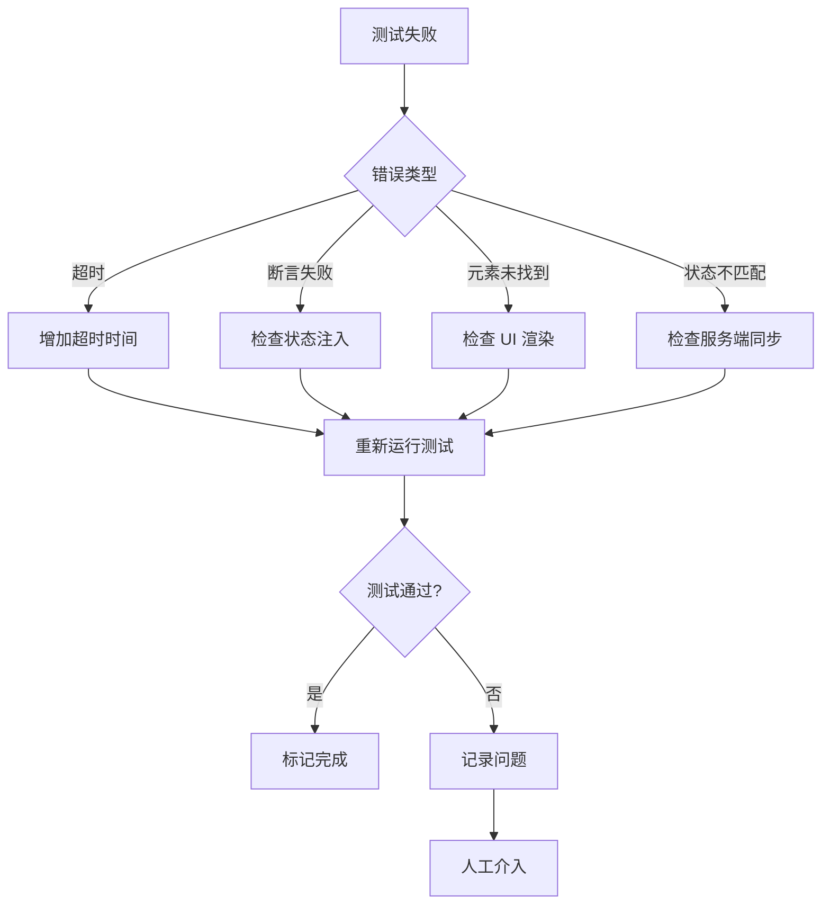

# Design Document

## Overview

本文档定义 Smash Up E2E 测试框架迁移的设计方案。


本设计基于已完成的状态注入服务端同步功能（`evidence/framework-migration-state-injection-sync.md`），将所有 Smash Up E2E 测试从旧框架迁移到新框架（"三板斧"模式）。

### 设计目标

1. **统一测试风格**：所有测试使用相同的"三板斧"模式（新框架 + 专用测试模式 + 状态注入）
2. **提高可维护性**：消除旧代码痕迹，使用封装良好的 API
3. **减少测试时间**：通过状态注入跳过前置步骤，从 180 秒降至 60 秒以内
4. **建立标准模板**：为未来的测试编写提供参考示例

### 设计原则

1. **渐进式迁移**：按优先级分批迁移，每批 2-3 个测试，确保质量
2. **保留旧测试**：迁移完成并验证通过后再删除旧测试
3. **截图对比**：迁移后的截图应该与旧测试一致
4. **测试隔离**：每个测试独立运行，不依赖其他测试
5. **错误处理**：测试失败时有清晰的错误信息

## Architecture

### 三板斧模式架构

```
┌─────────────────────────────────────────────────────────────┐
│                      测试文件                                │
│  import { test } from './framework'                         │
└─────────────────────────────────────────────────────────────┘
                            │
                            ▼
┌─────────────────────────────────────────────────────────────┐
│                   GameTestContext                           │
│  - setupScene()      : 状态注入                             │
│  - screenshot()      : 截图保存                             │
│  - waitForTestHarness() : 等待就绪                          │
│  - advancePhase()    : 推进阶段                             │
│  - waitForInteraction() : 等待交互                          │
│  - getState()        : 获取状态                             │
│  - selectOption()    : 选择选项                             │
└─────────────────────────────────────────────────────────────┘
                            │
                            ▼
┌─────────────────────────────────────────────────────────────┐
│                   TestHarness                               │
│  window.__BG_TEST_HARNESS__                                 │
│  - state.patch()     : 状态注入（内部使用）                 │
│  - dice.setValues()  : 骰子控制                             │
│  - command.execute() : 命令执行                             │
└─────────────────────────────────────────────────────────────┘
                            │
                            ▼
┌─────────────────────────────────────────────────────────────┐
│                   游戏引擎                                   │
│  - GameProvider      : 状态管理                             │
│  - GameTransportClient : 通信层                             │
│  - executePipeline   : 命令执行                             │
└─────────────────────────────────────────────────────────────┘
```

### 迁移流程架构

```
┌─────────────────┐
│  识别测试类型    │
│  - 旧 Fixture   │
│  - 旧 Helper    │
│  - 直接操作     │
└────────┬────────┘
         │
         ▼
┌─────────────────┐
│  替换为新框架    │
│  - import       │
│  - goto         │
│  - setupScene   │
└────────┬────────┘
         │
         ▼
┌─────────────────┐
│  验证迁移质量    │
│  - 测试通过     │
│  - 截图清晰     │
│  - 无旧代码     │
└────────┬────────┘
         │
         ▼
┌─────────────────┐
│  更新进度文档    │
│  - 标记完成     │
│  - 记录问题     │
└─────────────────┘
```

## Components and Interfaces

### 1. 测试文件结构

```typescript
// 标准测试文件结构
import { test, expect } from './framework';

test.describe('测试套件名称', () => {
  test('测试用例名称', async ({ page, game }, testInfo) => {
    // 1. 设置超时
    test.setTimeout(60000);
    
    // 2. 导航到游戏
    await page.goto('/play/smashup');
    
    // 3. 等待 TestHarness 就绪
    await page.waitForFunction(
      () => (window as any).__BG_TEST_HARNESS__?.state?.isRegistered(),
      { timeout: 15000 }
    );
    
    // 4. 状态注入
    await game.setupScene({
      gameId: 'smashup',
      player0: { /* 玩家 0 状态 */ },
      player1: { /* 玩家 1 状态 */ },
      bases: [ /* 基地状态 */ ],
      currentPlayer: '0',
      phase: 'playCards',
    });
    
    // 5. 等待渲染
    await page.waitForTimeout(2000);
    
    // 6. 测试逻辑
    await page.click('[data-card-uid="card-1"]');
    await page.waitForTimeout(1000);
    
    // 7. 断言
    await expect(page.getByText('预期文本')).toBeVisible();
    
    // 8. 截图
    await game.screenshot('test-result', testInfo);
  });
});
```

### 2. GameTestContext 接口

```typescript
interface GameTestContext {
  // 状态注入
  setupScene(config: SceneConfig): Promise<void>;
  
  // 截图保存
  screenshot(name: string, testInfo: TestInfo): Promise<void>;
  
  // 等待 TestHarness 就绪
  waitForTestHarness(timeout?: number): Promise<void>;
  
  // 推进阶段
  advancePhase(): Promise<void>;
  
  // 等待交互
  waitForInteraction(type: string, timeout?: number): Promise<void>;
  
  // 获取状态
  getState(): Promise<GameState>;
  
  // 选择选项
  selectOption(optionId: string): Promise<void>;
  
  // 获取交互选项
  getInteractionOptions(): Promise<InteractionOption[]>;
  
  // 打开测试游戏
  openTestGame(gameId: string, config: GameConfig): Promise<void>;
}

interface SceneConfig {
  gameId: string;
  player0?: PlayerState;
  player1?: PlayerState;
  player2?: PlayerState;
  player3?: PlayerState;
  bases?: BaseState[];
  currentPlayer: string;
  phase: string;
  extra?: {
    core?: Partial<CoreState>;
  };
}
```

### 3. 迁移检查清单接口

```typescript
interface MigrationChecklist {
  // 代码质量
  codeQuality: {
    usesNewFramework: boolean;        // 使用新框架
    usesSetupScene: boolean;          // 使用 setupScene
    usesGameScreenshot: boolean;      // 使用 game.screenshot
    noOldAPI: boolean;                // 无旧 API
    noDirectHarness: boolean;         // 无直接操作 TestHarness
    noOldRoute: boolean;              // 无旧路由
  };
  
  // 测试质量
  testQuality: {
    testPasses: boolean;              // 测试通过
    screenshotClear: boolean;         // 截图清晰
    timeUnder60s: boolean;            // 时间 < 60 秒
    noTimeout: boolean;               // 无超时
    noFlaky: boolean;                 // 无 flaky
  };
  
  // 文档
  documentation: {
    clearName: boolean;               // 名称清晰
    hasComments: boolean;             // 有注释
    descriptiveScreenshot: boolean;   // 截图有描述性文件名
  };
}
```

### 4. 进度追踪接口

```typescript
interface MigrationProgress {
  // 总体进度
  total: number;
  completed: number;
  percentage: number;
  
  // 分类进度
  priorities: {
    coreInteraction: { total: number; completed: number };
    halfMigrated: { total: number; completed: number };
    oldFixture: { total: number; completed: number };
    directHarness: { total: number; completed: number };
  };
  
  // 每日进度
  dailyProgress: Array<{
    date: string;
    completed: string[];
    issues: string[];
  }>;
  
  // 问题记录
  issues: Array<{
    description: string;
    solution: string;
    result: string;
  }>;
  
  // 下一步行动
  nextActions: {
    immediate: string;
    today: string;
    thisWeek: string;
  };
}
```

## Data Models

### 1. 测试分类模型

```typescript
enum TestCategory {
  CORE_INTERACTION = 'core_interaction',    // 核心交互测试
  HALF_MIGRATED = 'half_migrated',          // 半迁移测试
  OLD_FIXTURE = 'old_fixture',              // 旧 Fixture 测试
  DIRECT_HARNESS = 'direct_harness',        // 直接操作 TestHarness
  PAGE_FLOW = 'page_flow',                  // 页面流测试（不迁移）
}

interface TestFile {
  path: string;
  category: TestCategory;
  priority: number;
  status: 'pending' | 'in_progress' | 'completed';
  issues: string[];
}
```

### 2. 迁移任务模型

```typescript
interface MigrationTask {
  testFile: string;
  category: TestCategory;
  priority: number;
  
  // 迁移前状态
  before: {
    usesOldFixture: boolean;
    usesOldHelper: boolean;
    usesDirectHarness: boolean;
    testTime: number;
  };
  
  // 迁移后状态
  after: {
    usesNewFramework: boolean;
    usesSetupScene: boolean;
    testTime: number;
    screenshotPaths: string[];
  };
  
  // 迁移结果
  result: {
    success: boolean;
    testPasses: boolean;
    issues: string[];
  };
}
```

### 3. 场景配置模型

```typescript
interface SceneConfig {
  gameId: 'smashup';
  
  // 玩家状态
  player0?: {
    id: string;
    vp: number;
    hand: CardState[];
    deck: CardState[];
    discard: CardState[];
    field: MinionState[];
    factions: [string, string];
    minionsPlayed: number;
    minionLimit: number;
    actionsPlayed: number;
    actionLimit: number;
  };
  
  player1?: { /* 同上 */ };
  player2?: { /* 同上 */ };
  player3?: { /* 同上 */ };
  
  // 基地状态
  bases: Array<{
    defId: string;
    breakpoint: number;
    minions: MinionState[];
    ongoingActions?: CardState[];
  }>;
  
  // 游戏状态
  currentPlayer: '0' | '1' | '2' | '3';
  phase: 'playCards' | 'drawCards' | 'scoring';
  
  // 额外状态
  extra?: {
    core?: {
      turnOrder: string[];
      turnNumber: number;
      nextUid: number;
      baseDeck: string[];
      players: Record<string, PlayerState>;
    };
  };
}

interface CardState {
  uid: string;
  defId: string;
  type: 'minion' | 'action';
}

interface MinionState extends CardState {
  owner: string;
  controller: string;
  baseIndex?: number;
  power?: number;
}
```


## Correctness Properties

*A property is a characteristic or behavior that should hold true across all valid executions of a system-essentially, a formal statement about what the system should do. Properties serve as the bridge between human-readable specifications and machine-verifiable correctness guarantees.*

### Property 1: 迁移后测试通过且截图清晰

*For any* 迁移后的测试，运行测试应该通过且生成的截图应该清晰可见，能够验证游戏状态和 UI 元素。

**Validates: Requirements 1.9, 10.3**

### Property 2: 迁移后测试无超时错误

*For any* 迁移后的测试，运行测试应该在 Playwright 默认超时时间（30 秒）内完成，不应该出现超时错误。

**Validates: Requirements 1.10, 10.1**

### Property 3: 半迁移测试无旧代码痕迹

*For any* 半迁移测试，清理后的代码应该不包含旧代码痕迹（如 `harness.state.patch()` 直接调用、旧 API 调用），且测试应该通过。

**Validates: Requirements 2.7**

### Property 4: 旧 Fixture 测试无旧 API 调用

*For any* 旧 Fixture 测试，迁移后的代码应该不包含旧 API 调用（如 `setupSmashUpOnlineMatch`、`readCoreState`、`applyCoreState`），且测试应该通过。

**Validates: Requirements 3.5**

### Property 5: 直接操作 TestHarness 的测试代码可读性提高

*For any* 直接操作 TestHarness 的测试，迁移后的代码应该使用封装良好的 API（如 `game.setupScene()`、`game.screenshot()`），代码可读性应该提高，且测试应该通过。

**Validates: Requirements 4.5**

### Property 6: 迁移后测试无 flaky 行为

*For any* 迁移后的测试，连续运行 3 次应该均通过，不应该出现 flaky 行为（时而通过时而失败）。

**Validates: Requirements 10.2**

### Property 7: 迁移后测试时间减少

*For any* 迁移后的测试，通过状态注入跳过前置步骤，测试时间应该减少（相比旧框架的手动操作方式，从 180 秒降至 60 秒以内）。

**Validates: Requirements 10.5**

## Error Handling

### 1. 测试失败处理

```typescript
// 测试失败时的错误处理策略
interface TestFailureHandler {
  // 1. 捕获错误信息
  captureError(error: Error): ErrorInfo;
  
  // 2. 保存失败截图
  saveFailureScreenshot(testInfo: TestInfo): Promise<void>;
  
  // 3. 记录失败日志
  logFailure(testFile: string, error: ErrorInfo): void;
  
  // 4. 分析失败原因
  analyzeFailure(error: ErrorInfo): FailureReason;
  
  // 5. 提供修复建议
  suggestFix(reason: FailureReason): string[];
}

enum FailureReason {
  TIMEOUT = 'timeout',                    // 超时
  ASSERTION_FAILED = 'assertion_failed',  // 断言失败
  ELEMENT_NOT_FOUND = 'element_not_found', // 元素未找到
  STATE_MISMATCH = 'state_mismatch',      // 状态不匹配
  SCREENSHOT_FAILED = 'screenshot_failed', // 截图失败
}
```

### 2. 迁移错误处理

```typescript
// 迁移过程中的错误处理
interface MigrationErrorHandler {
  // 1. 识别错误类型
  identifyError(error: Error): MigrationErrorType;
  
  // 2. 回滚迁移
  rollback(testFile: string): Promise<void>;
  
  // 3. 记录错误
  logError(testFile: string, error: MigrationErrorType): void;
  
  // 4. 通知开发者
  notifyDeveloper(error: MigrationErrorType): void;
}

enum MigrationErrorType {
  OLD_API_REMAINING = 'old_api_remaining',        // 旧 API 残留
  SETUP_SCENE_FAILED = 'setup_scene_failed',      // 状态注入失败
  SCREENSHOT_PATH_WRONG = 'screenshot_path_wrong', // 截图路径错误
  TEST_TIMEOUT = 'test_timeout',                  // 测试超时
  FLAKY_TEST = 'flaky_test',                      // Flaky 测试
}
```

### 3. 状态注入错误处理

```typescript
// 状态注入失败时的错误处理
interface StateInjectionErrorHandler {
  // 1. 验证场景配置
  validateSceneConfig(config: SceneConfig): ValidationResult;
  
  // 2. 检查服务端同步
  checkServerSync(): Promise<boolean>;
  
  // 3. 重试注入
  retryInjection(config: SceneConfig, maxRetries: number): Promise<void>;
  
  // 4. 降级到手动操作
  fallbackToManual(config: SceneConfig): Promise<void>;
}

interface ValidationResult {
  valid: boolean;
  errors: string[];
  warnings: string[];
}
```

### 4. 错误恢复策略



## Testing Strategy

### 1. 测试层级

本迁移项目的测试策略分为三个层级：

#### 1.1 迁移验证测试（Migration Validation Tests）

**目的**：验证迁移后的测试文件符合新框架标准

**方法**：静态代码分析 + 运行时检查

```typescript
// 示例：验证测试文件使用新框架
test('验证测试文件使用新框架', () => {
  const testFiles = getAllSmashUpTestFiles();
  
  for (const file of testFiles) {
    const content = readFileSync(file, 'utf-8');
    
    // 检查是否使用新框架
    expect(content).toContain("import { test } from './framework'");
    expect(content).not.toContain("import { test } from './fixtures'");
    
    // 检查是否使用 setupScene
    if (shouldUseSetupScene(file)) {
      expect(content).toContain('game.setupScene(');
      expect(content).not.toContain('harness.state.patch(');
    }
    
    // 检查是否使用 game.screenshot
    expect(content).toContain('game.screenshot(');
  }
});
```

#### 1.2 功能回归测试（Functional Regression Tests）

**目的**：确保迁移后的测试功能与迁移前一致

**方法**：对比迁移前后的测试结果和截图

```typescript
// 示例：对比迁移前后的截图
test('对比迁移前后的截图', async () => {
  const testFile = 'smashup-ninja-infiltrate.e2e.ts';
  
  // 运行迁移前的测试
  const beforeScreenshots = await runTestAndGetScreenshots(testFile, 'before');
  
  // 运行迁移后的测试
  const afterScreenshots = await runTestAndGetScreenshots(testFile, 'after');
  
  // 对比截图
  for (let i = 0; i < beforeScreenshots.length; i++) {
    const similarity = compareImages(beforeScreenshots[i], afterScreenshots[i]);
    expect(similarity).toBeGreaterThan(0.95); // 95% 相似度
  }
});
```

#### 1.3 性能测试（Performance Tests）

**目的**：验证迁移后的测试性能提升

**方法**：测量测试执行时间

```typescript
// 示例：测量测试执行时间
test('测量测试执行时间', async () => {
  const testFile = 'smashup-ninja-infiltrate.e2e.ts';
  
  // 运行测试并测量时间
  const startTime = Date.now();
  await runTest(testFile);
  const endTime = Date.now();
  
  const executionTime = endTime - startTime;
  
  // 验证时间 < 60 秒
  expect(executionTime).toBeLessThan(60000);
  
  // 记录时间
  logExecutionTime(testFile, executionTime);
});
```

### 2. 测试工具选择

#### 2.1 E2E 测试：Playwright

**用途**：运行迁移后的测试，验证功能正确性

**配置**：
```typescript
// playwright.config.ts
export default defineConfig({
  testDir: './e2e',
  timeout: 60000,
  expect: {
    timeout: 15000,
  },
  use: {
    screenshot: 'only-on-failure',
    video: 'retain-on-failure',
  },
});
```

#### 2.2 单元测试：Vitest

**用途**：验证迁移逻辑和工具函数

**示例**：
```typescript
// 验证场景配置构建函数
describe('buildSceneConfig', () => {
  it('应该正确构建场景配置', () => {
    const config = buildSceneConfig({
      player0Hand: [{ defId: 'wizard_portal', type: 'action' }],
      player0Field: [{ defId: 'ninja_shinobi', baseIndex: 0, power: 3 }],
    });
    
    expect(config.player0.hand).toHaveLength(1);
    expect(config.player0.field).toHaveLength(1);
    expect(config.gameId).toBe('smashup');
  });
});
```

#### 2.3 静态分析：ESLint + 自定义规则

**用途**：检查代码是否符合新框架标准

**示例**：
```typescript
// 自定义 ESLint 规则：禁止使用旧 API
module.exports = {
  rules: {
    'no-old-api': {
      create(context) {
        return {
          ImportDeclaration(node) {
            if (node.source.value === './fixtures') {
              context.report({
                node,
                message: '禁止使用旧 Fixture 方式，请使用 ./framework',
              });
            }
          },
          CallExpression(node) {
            if (node.callee.name === 'setupSmashUpOnlineMatch') {
              context.report({
                node,
                message: '禁止使用旧 API，请使用 game.setupScene()',
              });
            }
          },
        };
      },
    },
  },
};
```

### 3. 测试覆盖目标

#### 3.1 代码覆盖率

- **目标**：迁移后的测试文件 100% 使用新框架
- **验证**：静态代码分析 + 人工审查

#### 3.2 功能覆盖率

- **目标**：迁移后的测试功能与迁移前一致
- **验证**：对比测试结果和截图

#### 3.3 性能覆盖率

- **目标**：迁移后的测试时间 < 60 秒
- **验证**：测量测试执行时间

### 4. 测试执行策略

#### 4.1 迁移前测试

```bash
# 运行迁移前的测试，保存结果和截图
npm run test:e2e:ci -- smashup-ninja-infiltrate.e2e.ts
cp -r test-results test-results-before
```

#### 4.2 迁移测试

```bash
# 迁移测试文件
# 1. 替换 import
# 2. 替换 API 调用
# 3. 添加 setupScene
# 4. 添加 screenshot
```

#### 4.3 迁移后测试

```bash
# 运行迁移后的测试，保存结果和截图
npm run test:e2e:ci -- smashup-ninja-infiltrate.e2e.ts
cp -r test-results test-results-after
```

#### 4.4 对比验证

```bash
# 对比迁移前后的截图
node scripts/compare-screenshots.mjs test-results-before test-results-after
```

### 5. 测试标签和组织

#### 5.1 测试标签

```typescript
// 使用标签组织测试
test.describe('核心交互测试 @priority-1', () => {
  test('忍者渗透 @ninja @infiltrate', async ({ page, game }, testInfo) => {
    // 测试逻辑
  });
});

test.describe('半迁移测试 @priority-2', () => {
  test('机器人悬浮机器人链 @robot @hoverbot', async ({ page, game }, testInfo) => {
    // 测试逻辑
  });
});
```

#### 5.2 测试组织

```
e2e/
├── smashup/
│   ├── core-interaction/          # 核心交互测试
│   │   ├── ninja-infiltrate.e2e.ts
│   │   ├── wizard-portal.e2e.ts
│   │   └── ...
│   ├── half-migrated/             # 半迁移测试
│   │   ├── robot-hoverbot-chain.e2e.ts
│   │   ├── zombie-lord.e2e.ts
│   │   └── ...
│   ├── old-fixture/               # 旧 Fixture 测试
│   │   └── ...
│   └── direct-harness/            # 直接操作 TestHarness
│       └── ...
└── framework.ts                   # 新框架
```

### 6. 持续集成测试

#### 6.1 CI 配置

```yaml
# .github/workflows/e2e-migration.yml
name: E2E Migration Tests

on:
  push:
    branches: [feat/smashup-e2e-migration]
  pull_request:
    branches: [main]

jobs:
  test:
    runs-on: ubuntu-latest
    steps:
      - uses: actions/checkout@v3
      - uses: actions/setup-node@v3
        with:
          node-version: '20'
      - run: npm ci
      - run: npm run test:e2e:ci
      - uses: actions/upload-artifact@v3
        if: always()
        with:
          name: test-results
          path: test-results/
```

#### 6.2 测试报告

```typescript
// 生成测试报告
interface TestReport {
  total: number;
  passed: number;
  failed: number;
  skipped: number;
  duration: number;
  
  tests: Array<{
    name: string;
    status: 'passed' | 'failed' | 'skipped';
    duration: number;
    error?: string;
    screenshots: string[];
  }>;
}
```


## Implementation Plan

### Phase 1: 核心交互测试迁移（Week 1）

**目标**：迁移 8 个核心交互测试

**步骤**：

1. **Day 1-2**：迁移 4 个测试
   - `smashup-ninja-infiltrate.e2e.ts`
   - `smashup-wizard-portal.e2e.ts`
   - `smashup-multi-base-scoring-complete.e2e.ts`
   - `smashup-multi-base-scoring-simple.e2e.ts`

2. **Day 3-4**：迁移 4 个测试
   - `smashup-pirate-cove-scoring-bug.e2e.ts`
   - `smashup-innsmouth-locals-reveal.e2e.ts`
   - `smashup-base-minion-selection.e2e.ts`
   - `smashup-afterscoring-simple-complete.e2e.ts`

**验收标准**：
- [ ] 所有 8 个测试通过
- [ ] 截图清晰且与迁移前一致
- [ ] 测试时间 < 60 秒
- [ ] 无旧 API 调用
- [ ] 无 `harness.state.patch()` 直接调用

### Phase 2: 半迁移测试清理（Week 2）

**目标**：清理 7 个半迁移测试

**步骤**：

1. **Day 1-2**：清理 4 个测试
   - `smashup-robot-hoverbot-chain.e2e.ts`
   - `smashup-zombie-lord.e2e.ts`
   - `smashup-complex-multi-base-scoring.e2e.ts`
   - `smashup-phase-transition-simple.e2e.ts`

2. **Day 3**：清理 3 个测试
   - `smashup-response-window-pass-test.e2e.ts`
   - `smashup-robot-hoverbot-new.e2e.ts`
   - （预留 1 天缓冲）

**验收标准**：
- [ ] 所有 7 个测试通过
- [ ] 无旧代码痕迹
- [ ] 统一使用 `game.setupScene()`
- [ ] 统一使用 `game.screenshot()`

### Phase 3: 批量迁移（Week 3-4）

**目标**：迁移 40 个测试（18 个旧 Fixture + 22 个直接操作 TestHarness）

**步骤**：

1. **Week 3**：迁移旧 Fixture 测试（18 个）
   - Day 1-2：迁移 6 个
   - Day 3-4：迁移 6 个
   - Day 5：迁移 6 个

2. **Week 4**：迁移直接操作 TestHarness 的测试（22 个）
   - Day 1-2：迁移 8 个
   - Day 3-4：迁移 8 个
   - Day 5：迁移 6 个

**验收标准**：
- [ ] 所有 40 个测试通过
- [ ] 无旧 API 调用
- [ ] 无直接操作 TestHarness
- [ ] 测试时间 < 60 秒

### Phase 4: 清理和验证（Week 5）

**目标**：删除旧代码，运行所有测试，更新文档

**步骤**：

1. **Day 1**：删除旧代码
   - 删除 `e2e/fixtures/` 目录
   - 删除 `e2e/helpers/smashup.ts` 中的旧函数
   - 删除旧的测试模式路由

2. **Day 2**：运行所有测试
   - 运行 `npm run test:e2e:ci`
   - 验证所有测试通过
   - 检查测试时间

3. **Day 3**：更新文档
   - 更新 `docs/automated-testing.md`
   - 更新 `evidence/smashup-e2e-migration-progress.md`
   - 创建迁移总结文档

4. **Day 4-5**：缓冲时间
   - 修复遗留问题
   - 优化测试性能
   - 代码审查

**验收标准**：
- [ ] 所有测试通过
- [ ] 旧代码已删除
- [ ] 文档已更新
- [ ] 迁移总结已完成

## Migration Workflow

### 1. 识别测试类型

```typescript
// 工具函数：识别测试类型
function identifyTestType(testFile: string): TestCategory {
  const content = readFileSync(testFile, 'utf-8');
  
  // 检查是否使用旧 Fixture
  if (content.includes("import { test } from './fixtures'") ||
      content.includes('smashupMatch')) {
    return TestCategory.OLD_FIXTURE;
  }
  
  // 检查是否使用旧 Helper
  if (content.includes('setupSmashUpOnlineMatch') ||
      content.includes('readCoreState') ||
      content.includes('applyCoreState')) {
    return TestCategory.OLD_FIXTURE;
  }
  
  // 检查是否直接操作 TestHarness
  if (content.includes('__BG_TEST_HARNESS__') &&
      content.includes('harness.state.patch(')) {
    return TestCategory.DIRECT_HARNESS;
  }
  
  // 检查是否半迁移
  if (content.includes("import { test } from './framework'") &&
      (content.includes('harness.state.patch(') ||
       content.includes('setupSmashUpOnlineMatch'))) {
    return TestCategory.HALF_MIGRATED;
  }
  
  // 检查是否核心交互测试
  if (isCoreInteractionTest(testFile)) {
    return TestCategory.CORE_INTERACTION;
  }
  
  // 页面流测试
  return TestCategory.PAGE_FLOW;
}
```

### 2. 迁移步骤

```typescript
// 工具函数：迁移测试文件
async function migrateTestFile(testFile: string): Promise<MigrationResult> {
  // 1. 识别测试类型
  const category = identifyTestType(testFile);
  
  // 2. 备份原文件
  await backupFile(testFile);
  
  // 3. 替换 import
  await replaceImport(testFile);
  
  // 4. 替换 API 调用
  await replaceAPICall(testFile, category);
  
  // 5. 添加 setupScene
  await addSetupScene(testFile);
  
  // 6. 添加 screenshot
  await addScreenshot(testFile);
  
  // 7. 运行测试
  const testResult = await runTest(testFile);
  
  // 8. 验证迁移
  const validation = await validateMigration(testFile, testResult);
  
  // 9. 更新进度
  await updateProgress(testFile, validation);
  
  return {
    testFile,
    category,
    success: validation.success,
    issues: validation.issues,
  };
}
```

### 3. 验证迁移

```typescript
// 工具函数：验证迁移质量
async function validateMigration(
  testFile: string,
  testResult: TestResult
): Promise<ValidationResult> {
  const content = readFileSync(testFile, 'utf-8');
  const issues: string[] = [];
  
  // 检查代码质量
  if (!content.includes("import { test } from './framework'")) {
    issues.push('未使用新框架');
  }
  
  if (!content.includes('game.setupScene(')) {
    issues.push('未使用 setupScene');
  }
  
  if (!content.includes('game.screenshot(')) {
    issues.push('未使用 game.screenshot');
  }
  
  if (content.includes('setupSmashUpOnlineMatch') ||
      content.includes('readCoreState') ||
      content.includes('applyCoreState')) {
    issues.push('存在旧 API 调用');
  }
  
  if (content.includes('harness.state.patch(')) {
    issues.push('存在直接操作 TestHarness');
  }
  
  // 检查测试质量
  if (!testResult.passed) {
    issues.push('测试未通过');
  }
  
  if (testResult.duration > 60000) {
    issues.push('测试时间超过 60 秒');
  }
  
  if (testResult.screenshots.length === 0) {
    issues.push('未生成截图');
  }
  
  return {
    success: issues.length === 0,
    issues,
  };
}
```

### 4. 更新进度

```typescript
// 工具函数：更新进度文档
async function updateProgress(
  testFile: string,
  validation: ValidationResult
): Promise<void> {
  const progressFile = 'evidence/smashup-e2e-migration-progress.md';
  const content = readFileSync(progressFile, 'utf-8');
  
  // 更新测试状态
  const updatedContent = content.replace(
    `- [ ] \`${testFile}\``,
    `- [${validation.success ? 'x' : ' '}] \`${testFile}\`${
      validation.issues.length > 0
        ? ` - 问题：${validation.issues.join(', ')}`
        : ''
    }`
  );
  
  // 更新总体进度
  const completed = (updatedContent.match(/- \[x\]/g) || []).length;
  const total = (updatedContent.match(/- \[[ x]\]/g) || []).length;
  const percentage = Math.round((completed / total) * 100);
  
  const finalContent = updatedContent.replace(
    /当前进度：\d+\/\d+（\d+%）/,
    `当前进度：${completed}/${total}（${percentage}%）`
  );
  
  writeFileSync(progressFile, finalContent, 'utf-8');
}
```

## Rollback Strategy

### 1. 备份策略

```typescript
// 迁移前备份原文件
async function backupFile(testFile: string): Promise<void> {
  const backupDir = 'e2e/.migration-backup';
  const backupFile = path.join(backupDir, path.basename(testFile));
  
  await fs.mkdir(backupDir, { recursive: true });
  await fs.copyFile(testFile, backupFile);
}
```

### 2. 回滚策略

```typescript
// 迁移失败时回滚
async function rollbackMigration(testFile: string): Promise<void> {
  const backupDir = 'e2e/.migration-backup';
  const backupFile = path.join(backupDir, path.basename(testFile));
  
  if (await fs.exists(backupFile)) {
    await fs.copyFile(backupFile, testFile);
    console.log(`已回滚 ${testFile}`);
  } else {
    console.error(`未找到备份文件 ${backupFile}`);
  }
}
```

### 3. 清理备份

```typescript
// 迁移成功后清理备份
async function cleanupBackup(testFile: string): Promise<void> {
  const backupDir = 'e2e/.migration-backup';
  const backupFile = path.join(backupDir, path.basename(testFile));
  
  if (await fs.exists(backupFile)) {
    await fs.unlink(backupFile);
    console.log(`已清理备份 ${backupFile}`);
  }
}
```

## Success Criteria

### 1. 代码质量标准

- [ ] 所有测试使用 `import { test } from './framework'`
- [ ] 所有测试使用 `game.setupScene()` 构建场景
- [ ] 所有测试使用 `game.screenshot()` 保存截图
- [ ] 无旧 API 调用（`setupSmashUpOnlineMatch`, `readCoreState`, `applyCoreState`）
- [ ] 无 `harness.state.patch()` 直接调用
- [ ] 无 `/play/smashup/test` 路由

### 2. 测试质量标准

- [ ] 所有测试通过（`npm run test:e2e:ci` 全部通过）
- [ ] 截图清晰且有意义
- [ ] 测试时间 < 60 秒
- [ ] 无超时错误
- [ ] 无 flaky 行为（连续运行 3 次均通过）

### 3. 文档标准

- [ ] 测试名称清晰
- [ ] 有注释说明测试场景
- [ ] 截图有描述性文件名
- [ ] 进度文档已更新
- [ ] 迁移总结已完成

### 4. 性能标准

- [ ] 测试速度提升（60 秒 vs 180 秒）
- [ ] 状态注入成功率 > 99%
- [ ] 测试稳定性提升（flaky 率 < 1%）

### 5. 清理标准

- [ ] 删除 `e2e/fixtures/` 目录
- [ ] 删除 `e2e/helpers/smashup.ts` 中的旧函数
- [ ] 删除旧的测试模式路由
- [ ] 更新 `docs/automated-testing.md`

## Risk Assessment

### 1. 高风险项

#### 1.1 状态注入失败

**风险**：状态注入可能因为服务端同步问题而失败

**缓解措施**：
- 增加重试机制
- 添加详细的错误日志
- 提供降级到手动操作的选项

#### 1.2 测试 Flaky

**风险**：迁移后的测试可能出现 flaky 行为

**缓解措施**：
- 增加等待时间
- 使用 `expect.poll()` 替代固定等待
- 连续运行 3 次验证稳定性

#### 1.3 截图不一致

**风险**：迁移后的截图可能与迁移前不一致

**缓解措施**：
- 对比迁移前后的截图
- 使用图像相似度算法验证
- 人工审查关键截图

### 2. 中风险项

#### 2.1 测试时间超时

**风险**：某些测试可能因为复杂场景而超时

**缓解措施**：
- 增加测试超时时间
- 优化状态注入逻辑
- 拆分复杂测试为多个小测试

#### 2.2 旧代码残留

**风险**：迁移后可能残留旧代码痕迹

**缓解措施**：
- 使用静态代码分析
- 人工审查代码
- 使用 ESLint 自定义规则

### 3. 低风险项

#### 3.1 文档更新遗漏

**风险**：可能遗漏某些文档更新

**缓解措施**：
- 使用检查清单
- 代码审查
- 最终验证

## Timeline

### Week 1: 核心交互测试迁移
- Day 1-2：迁移 4 个测试
- Day 3-4：迁移 4 个测试
- Day 5：验证和修复

### Week 2: 半迁移测试清理
- Day 1-2：清理 4 个测试
- Day 3：清理 3 个测试
- Day 4-5：验证和修复

### Week 3: 旧 Fixture 测试迁移
- Day 1-2：迁移 6 个测试
- Day 3-4：迁移 6 个测试
- Day 5：迁移 6 个测试

### Week 4: 直接操作 TestHarness 的测试迁移
- Day 1-2：迁移 8 个测试
- Day 3-4：迁移 8 个测试
- Day 5：迁移 6 个测试

### Week 5: 清理和验证
- Day 1：删除旧代码
- Day 2：运行所有测试
- Day 3：更新文档
- Day 4-5：缓冲时间

## Conclusion

本设计文档定义了 Smash Up E2E 测试框架迁移的完整方案，包括架构设计、组件接口、数据模型、错误处理、测试策略、实现计划、迁移工作流、回滚策略、成功标准、风险评估和时间表。

通过遵循本设计，我们将：
1. 统一测试风格，所有测试使用"三板斧"模式
2. 提高可维护性，消除旧代码痕迹
3. 减少测试时间，从 180 秒降至 60 秒以内
4. 建立标准模板，为未来的测试编写提供参考

迁移完成后，所有 Smash Up E2E 测试将使用新框架，测试质量和性能将得到显著提升。

