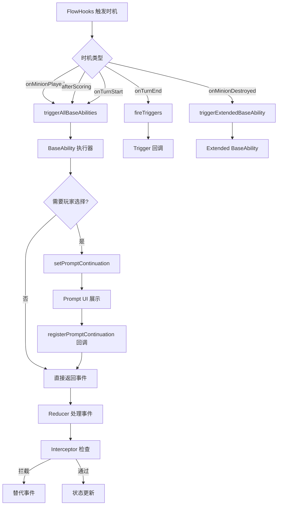

# 设计文档：Smash Up Phase 3 剩余能力实现

## 概述

本设计覆盖 Smash Up Phase 3 所有剩余 TODO 项的实现方案。核心思路是复用已有的 Ability_System、Prompt_System、Interceptor 和 BaseAbility 注册表模式，不引入新的架构概念。所有改动集中在 `src/games/smashup/` 目录下的领域层和能力文件中。

### 设计决策

1. **复用已有事件类型**：`CARD_TO_DECK_BOTTOM`、`MINION_MOVED`、`LIMIT_MODIFIED` 等已有事件类型足以覆盖所有需求，无需新增事件类型（除 REVEAL_HAND/REVEAL_DECK_TOP 用于需要 UI 的能力）。
2. **力量校验通过 restriction 机制实现**：母星和神秘花园的力量≤2 限制通过 `isOperationRestricted` 注册表实现，与现有限制类基地一致。
3. **被动保护类基地通过 protection 注册表实现**：美丽城堡和小马乐园通过 `registerProtection` 注册，与现有保护机制一致。
4. **文件拆分**：`baseAbilities.ts` 当前已接近行数限制，新增基地能力将按扩展包拆分到独立文件。
5. **需要 UI 的能力标注 TODO**：外星人 Probe/Scout Ship 和密大 Book of Iter 需要 REVEAL_HAND 事件类型和 UI 展示组件，本次仅定义事件类型和占位逻辑。

## 架构

### 组件交互流程



### 文件变更范围

| 文件 | 变更类型 | 说明 |
|------|----------|------|
| `abilities/pirates.ts` | 修改 | Full Sail continuation 已有，验证完整性 |
| `abilities/cthulhu.ts` | 修改 | Complete the Ritual 改用 CARD_TO_DECK_BOTTOM |
| `domain/baseAbilities.ts` | 修改 | 母星力量校验、新增简单基地能力 |
| `domain/baseAbilities_expansion.ts` | 新增 | 扩展包基地能力（克苏鲁/AL9000/Pretty Pretty） |
| `domain/ongoingEffects.ts` | 修改 | 注册美丽城堡/小马乐园保护 |
| `domain/types.ts` | 修改 | 新增 REVEAL_HAND / REVEAL_DECK_TOP 事件类型 |
| `domain/reducer.ts` | 修改 | 处理新事件类型 |
| `abilities/aliens.ts` | 修改 | Probe/Scout Ship 实现（产生 REVEAL 事件） |
| `abilities/miskatonic.ts` | 修改 | Book of Iter 实现（产生 REVEAL 事件） |
| `ui/CardRevealOverlay.tsx` | 新增 | 卡牌展示 UI 组件（手牌/牌库顶查看） |
| `Board.tsx` | 修改 | 集成 CardRevealOverlay |
| `domain/index.ts` | 修改 | playerView 过滤 pendingReveal、疯狂卡平局规则 |

## 组件与接口

### 1. Full Sail 多步移动（需求 1）

已有实现基本完整（`pirateFullSail` + `buildFullSailChooseMinionPrompt` + 两个 continuation）。需验证：
- `pirate_full_sail_choose_minion` continuation 正确处理 `done` 选项
- `pirate_full_sail_choose_base` continuation 正确传递 `movedUids` 并循环调用 `buildFullSailChooseMinionPrompt`
- 已移动随从被排除

当前代码已实现此逻辑，主要工作是补充测试。

### 2. Complete the Ritual 修正（需求 4）

修改 `cthulhuCompleteTheRitualTrigger`：

```typescript
// 修改前：MINION_RETURNED（返回手牌）
events.push({
    type: SU_EVENTS.MINION_RETURNED,
    payload: { minionUid: m.uid, ... toPlayerId: m.owner },
});

// 修改后：CARD_TO_DECK_BOTTOM（放牌库底）
events.push({
    type: SU_EVENTS.CARD_TO_DECK_BOTTOM,
    payload: { cardUid: m.uid, defId: m.defId, ownerId: m.owner, reason: 'cthulhu_complete_the_ritual' },
});
```

同样修改 ongoing 行动卡的处理，从 `ONGOING_DETACHED` 改为 `CARD_TO_DECK_BOTTOM`。

### 3. 母星力量≤2 校验（需求 3）

通过 `registerRestriction` 注册限制规则：

```typescript
registerRestriction('base_the_homeworld', 'minionPowerLimit', (ctx) => {
    // 检查是否是额外出牌（minionLimit > 0 表示有额外机会）
    // 且目标基地是母星时，限制力量≤2
    if (ctx.baseIndex === homeworldIndex && ctx.minionPower > 2) return true;
    return false;
});
```

实际实现需要在 `isOperationRestricted` 中增加力量检查分支，或在 `BaseCardDef.restrictions` 数据中配置。

### 4. 基地能力 Prompt 化（需求 5-8）

所有 Prompt 化基地遵循统一模式：

```typescript
// 1. 注册基地能力
registerBaseAbility('base_xxx', timing, (ctx) => {
    // 构建选项列表
    const options = [...candidates, { id: 'skip', label: '跳过', value: { skip: true } }];
    return {
        events: [setPromptContinuation({
            abilityId: 'base_xxx',
            playerId: ctx.playerId,
            data: { promptConfig: { title: '...', options } },
        }, ctx.now)],
    };
});

// 2. 注册 continuation
registerPromptContinuation('base_xxx', (ctx) => {
    const selected = ctx.selectedValue as { skip?: boolean; ... };
    if (selected.skip) return [];
    // 返回对应事件
    return [moveMinion(...) / destroyMinion(...) / ...];
});
```

#### 各基地实现要点

| 基地 | 时机 | 核心逻辑 |
|------|------|----------|
| 海盗湾 | afterScoring | 遍历非冠军玩家，为每位有随从的玩家生成移动 Prompt |
| 托尔图加 | afterScoring | 仅亚军，移动到替换基地（需要知道新基地 index） |
| 巫师学院 | afterScoring | 冠军查看基地牌库顶 3 张，选择排列顺序 |
| 蘑菇王国 | onTurnStart | 列出所有基地上的对手随从，选择移动到蘑菇王国 |
| 疯人院 | onMinionPlayed | 列出手牌/弃牌堆中的疯狂卡，选择返回疯狂牌堆 |
| 印斯茅斯基地 | onMinionPlayed | 列出任意玩家弃牌堆卡牌，选择放牌库底 |
| 密大基地 | afterScoring | 有随从的玩家可返回疯狂卡 |
| 冷原高地 | onMinionPlayed | 检查手牌同名随从，可选打出 |
| 温室 | afterScoring | 冠军搜牌库选随从打出到新基地 |
| 神秘花园 | onTurnStart | 授予额外出牌机会（力量≤2 限制同母星） |
| 发明家沙龙 | afterScoring | 冠军从弃牌堆选行动卡放入手牌 |
| 诡猫巷 | talent（每回合一次） | 选择消灭己方随从，抽 1 卡 |
| 九命之屋 | interceptor | 拦截 MINION_DESTROYED，提供移动选项 |
| 魔法林地 | onActionPlayed | 附着行动到随从后抽 1 卡 |
| 仙灵之环 | onMinionPlayed（首次） | 授予额外随从+行动出牌机会 |
| 平衡之地 | onMinionPlayed | 选择移动己方其他基地随从到此 |

### 5. 被动保护类基地（需求 9）

```typescript
// 美丽城堡：力量≥5 随从免疫影响
registerProtection('base_beautiful_castle', 'affect', (ctx) => {
    const power = getEffectivePower(ctx.state, ctx.targetMinion, ctx.targetBaseIndex);
    return power >= 5 && ctx.targetBaseIndex === beautifulCastleIndex;
});

// 小马乐园：2+ 随从免疫消灭
registerProtection('base_pony_paradise', 'destroy', (ctx) => {
    const base = ctx.state.bases[ctx.targetBaseIndex];
    const ownerMinionCount = base.minions.filter(m => m.controller === ctx.targetMinion.controller).length;
    return ownerMinionCount >= 2 && ctx.targetBaseIndex === ponyParadiseIndex;
});
```

注意：这些保护是基地级别的，需要在保护检查时动态查找基地 index。

### 6. 需要 UI 的能力（需求 10）— 卡牌展示系统

#### 6.1 事件类型

```typescript
// domain/types.ts
REVEAL_HAND: 'su:reveal_hand',
REVEAL_DECK_TOP: 'su:reveal_deck_top',

interface RevealHandEvent extends GameEvent<typeof SU_EVENTS.REVEAL_HAND> {
    payload: {
        targetPlayerId: string;   // 被查看的玩家
        viewerPlayerId: string;   // 查看者
        cards: { uid: string; defId: string }[];  // 被展示的卡牌列表
        reason: string;           // 触发原因（alien_probe / book_of_iter 等）
    };
}

interface RevealDeckTopEvent extends GameEvent<typeof SU_EVENTS.REVEAL_DECK_TOP> {
    payload: {
        targetPlayerId: string;   // 牌库所有者
        viewerPlayerId: string;   // 查看者
        cards: { uid: string; defId: string }[];  // 牌库顶卡牌
        count: number;            // 展示数量
        reason: string;
    };
}
```

#### 6.2 Reducer 处理

Reducer 将展示信息写入 `SmashUpCore` 的新字段 `pendingReveal`：

```typescript
// domain/types.ts - SmashUpCore 新增字段
pendingReveal?: {
    type: 'hand' | 'deck_top';
    targetPlayerId: string;
    viewerPlayerId: string;
    cards: { uid: string; defId: string }[];
    reason: string;
};
```

Reducer 处理 REVEAL_HAND / REVEAL_DECK_TOP 时写入 `pendingReveal`，UI 层读取后展示。玩家确认后通过 move 清除 `pendingReveal`。

#### 6.3 UI 组件：CardRevealOverlay

新增 `src/games/smashup/ui/CardRevealOverlay.tsx`，复用现有 `CardPreview` 组件和 `PromptOverlay` 的视觉风格。

```mermaid
graph TD
    A[pendingReveal 存在] --> B[CardRevealOverlay 渲染]
    B --> C[展示卡牌网格]
    C --> D[每张卡用 CardPreview 渲染]
    D --> E[底部"确认"按钮]
    E --> F[调用 moves.dismissReveal]
    F --> G[清除 pendingReveal]
```

**组件结构**：

```
CardRevealOverlay
├── 半透明遮罩（bg-black/40）
├── Modal 容器（复用 PromptOverlay 风格）
│   ├── Header：标题（如"对手手牌"/"牌库顶3张"）+ 原因说明
│   ├── 横向可滚动卡牌行（flex, overflow-x-auto, gap-3, snap-x）
│   │   └── 每张卡：CardPreview + 卡名标签（固定宽度，纵向排列）
│   └── Footer："确认"按钮（仅查看者可点击）
```

**视觉规范**：
- 遮罩层 z-index 使用 `UI_Z_INDEX.overlay`（与 PromptOverlay 一致）
- 卡牌横向一排排列，超出容器宽度时可水平滚动（`overflow-x-auto`），类似 DiceThrone 手牌区风格
- 每张卡固定宽度（约 `w-[120px]`），高度按卡牌比例（`aspect-[0.714]`）
- 卡牌间距 `gap-3`，容器内边距 `px-6 py-4`
- 非查看者看到"等待对方确认"提示
- 使用 framer-motion 的 `AnimatePresence` 实现进出动画

#### 6.4 playerView 处理

`playerView` 函数需要过滤 `pendingReveal`：
- 如果 `pendingReveal.viewerPlayerId !== currentPlayerId`，则隐藏 `cards` 字段（替换为空数组或卡背）
- 确保对手手牌信息不泄露给非查看者

#### 6.5 各能力的具体实现

| 能力 | 事件类型 | 展示内容 | 后续操作 |
|------|----------|----------|----------|
| Alien Probe | REVEAL_HAND | 目标对手全部手牌 | 仅查看，确认后关闭 |
| Alien Scout Ship | REVEAL_DECK_TOP | 自己牌库顶 1 张 + 对手手牌 | 仅查看 |
| Book of Iter | REVEAL_HAND | 目标对手全部手牌 | 仅查看（额外行动已单独处理） |

### 7. Full Sail Special 时机（需求 11）

需要 `beforeScoring` 阶段的 special action 机制。当前 FlowHooks 中 `beforeScoring` 时机已存在，但缺少"从手牌打出 special 卡"的通用机制。本次标注 TODO，不实现。

### 8. 疯狂卡终局 VP 惩罚（需求 12）

`madnessVpPenalty` 和 `countMadnessCards` 已实现，`getScores` 已调用。疯狂卡平局规则（较少者胜）需要在 `isGameOver` 中增加：

```typescript
// 平局时比较疯狂卡数量
const madnessA = countMadnessCards(state.players[sorted[0]]);
const madnessB = countMadnessCards(state.players[sorted[1]]);
if (madnessA !== madnessB) {
    return { winner: madnessA < madnessB ? sorted[0] : sorted[1], scores };
}
```

## 数据模型

### 新增事件类型

```typescript
REVEAL_HAND = 'su:reveal_hand'
REVEAL_DECK_TOP = 'su:reveal_deck_top'
```

### 新增状态字段

```typescript
// SmashUpCore 新增
pendingReveal?: {
    type: 'hand' | 'deck_top';
    targetPlayerId: string;
    viewerPlayerId: string;
    cards: { uid: string; defId: string }[];
    reason: string;
};
```

### 状态字段（已有，无需新增）

- `turnDestroyedMinions`: 已在 `SmashUpCore` 上定义
- `madnessDeck`: 已在 `SmashUpCore` 上定义
- `CARD_TO_DECK_BOTTOM`: 已有事件类型和 Reducer 处理

### 基地能力文件拆分

当前 `baseAbilities.ts` 包含所有基地能力注册。新增基地能力按扩展包拆分：

```
domain/
├── baseAbilities.ts              # 基础版基地 + 注册表核心
├── baseAbilities_expansion.ts    # 扩展包基地能力（克苏鲁/AL9000/Pretty Pretty）
```

`baseAbilities_expansion.ts` 导出 `registerExpansionBaseAbilities()` 和 `registerExpansionBasePromptContinuations()`，在 `registerBaseAbilities()` 末尾调用。


## 正确性属性（Correctness Properties）

*正确性属性是系统在所有有效执行中应保持为真的特征或行为——本质上是关于系统应该做什么的形式化陈述。属性作为人类可读规范与机器可验证正确性保证之间的桥梁。*

### Property 1: Full Sail 随从收集正确性

*For any* 棋盘状态和玩家，Full Sail 的"选择随从"Prompt 选项应恰好包含该玩家在所有基地上尚未被移动过的己方随从，不多不少。

**Validates: Requirements 1.1, 1.6**

### Property 2: Full Sail 继续链正确性

*For any* Full Sail 中的随从选择，后续"选择目标基地"Prompt 应排除该随从当前所在基地；选择基地后应产生 MINION_MOVED 事件并重新生成包含剩余未移动随从的"选择随从"Prompt。

**Validates: Requirements 1.2, 1.3**

### Property 3: Furthering the Cause VP 判定

*For any* 包含 Furthering the Cause 持续行动卡的基地，回合结束时产生 VP_AWARDED 事件当且仅当 `turnDestroyedMinions` 中存在该基地上被消灭的对手随从记录。

**Validates: Requirements 2.3, 2.4, 2.5**

### Property 4: turnDestroyedMinions 追踪

*For any* MINION_DESTROYED 事件，Reducer 处理后 `turnDestroyedMinions` 数组长度应增加 1，且新增记录的 defId、baseIndex、owner 与事件 payload 一致。

**Validates: Requirements 2.1**

### Property 5: turnDestroyedMinions 回合清空

*For any* TURN_CHANGED 事件，Reducer 处理后 `turnDestroyedMinions` 应为空数组。

**Validates: Requirements 2.2**

### Property 6: 力量≤2 出牌限制（母星 + 神秘花园）

*For any* 随从卡，在母星或神秘花园使用额外出牌机会时，操作被允许当且仅当该随从的力量小于等于 2。

**Validates: Requirements 3.2, 3.3, 7b.4, 7b.5**

### Property 7: Complete the Ritual 放牌库底

*For any* 包含 Complete the Ritual 持续行动卡的基地，触发时基地上的所有随从和持续行动卡应产生 CARD_TO_DECK_BOTTOM 事件（而非 MINION_RETURNED 或 ONGOING_DETACHED）。

**Validates: Requirements 4.1, 4.2**

### Property 8: 海盗湾非冠军 Prompt 生成

*For any* 海盗湾计分结果，除冠军外的每位在此有随从的玩家应收到移动 Prompt，冠军不应收到 Prompt。

**Validates: Requirements 5a.1**

### Property 9: 蘑菇王国对手随从列表

*For any* 包含蘑菇王国的棋盘状态，回合开始时生成的 Prompt 选项应恰好包含所有基地上属于对手的随从，不包含当前玩家的随从。

**Validates: Requirements 5d.9**

### Property 10: 九命之屋拦截

*For any* MINION_DESTROYED 事件（目标不在九命之屋），若九命之屋在场，拦截器应将消灭替换为移动到九命之屋的选项。

**Validates: Requirements 8b.4, 8b.5**

### Property 11: 平衡之地其他基地随从列表

*For any* 在平衡之地打出随从后，生成的 Prompt 选项应恰好包含该玩家在其他基地（非平衡之地）的所有随从。

**Validates: Requirements 8e.9**

### Property 12: 美丽城堡力量≥5 保护

*For any* 美丽城堡上力量大于等于 5 的随从，`isMinionProtected` 对 'affect' 类型检查应返回 true。

**Validates: Requirements 9a.1, 9a.2**

### Property 13: 小马乐园 2+ 随从保护

*For any* 小马乐园上拥有 2 个或以上随从的玩家，该玩家的随从在 `isMinionProtected` 对 'destroy' 类型检查时应返回 true。

**Validates: Requirements 9b.3, 9b.4**

## 错误处理

### 边界情况

| 场景 | 处理方式 |
|------|----------|
| Full Sail 时无己方随从 | 返回空事件列表，不生成 Prompt |
| Full Sail 所有随从已移动 | 自动结束，返回空事件列表 |
| 海盗湾计分后无非冠军玩家有随从 | 不生成任何 Prompt |
| 托尔图加无亚军或亚军无随从 | 不生成 Prompt |
| 巫师学院基地牌库不足 3 张 | 展示实际可用数量 |
| 蘑菇王国无对手随从 | 不生成 Prompt（或仅显示"跳过"） |
| 疯人院/密大基地无疯狂卡 | 不生成 Prompt |
| 冷原高地手牌无同名随从 | 不生成 Prompt |
| 温室牌库无随从 | 不生成 Prompt |
| 发明家沙龙弃牌堆无行动卡 | 不生成 Prompt |
| 诡猫巷本回合已使用 | 不生成 Prompt |
| 九命之屋已满（无空间） | 不拦截，正常消灭 |
| 美丽城堡上力量因 buff 变化 | 实时计算 `getEffectivePower` |
| 小马乐园随从数因消灭变化 | 每次检查时重新计算 |

### 事件类型安全

- 所有新增 Prompt continuation 的 `selectedValue` 类型断言使用 `as` 并在使用前检查关键字段
- `CARD_TO_DECK_BOTTOM` 事件的 Reducer 已有完整处理，无需新增
- `REVEAL_HAND` / `REVEAL_DECK_TOP` 事件写入 `pendingReveal`，UI 层通过 `CardRevealOverlay` 展示
- `playerView` 过滤确保非查看者无法看到展示的卡牌内容

## 测试策略

### 测试框架

- **单元测试**：Vitest
- **属性测试**：fast-check（已在项目中使用，见 `__tests__/properties/`）
- **测试文件组织**：按功能模块拆分到 `src/games/smashup/__tests__/` 下

### 属性测试配置

- 每个属性测试最少运行 100 次迭代
- 每个属性测试必须用注释引用设计文档中的属性编号
- 标签格式：**Feature: smashup-phase3-remaining, Property {number}: {property_text}**
- 每个正确性属性对应一个独立的属性测试

### 单元测试覆盖

单元测试聚焦于：
- 各基地能力的具体示例（正常路径 + 跳过路径）
- 边界情况（无随从、无疯狂卡、牌库为空等）
- Continuation 回调的正确事件产出
- 需要 UI 的能力的事件类型验证

### 测试文件规划

| 测试文件 | 覆盖内容 |
|----------|----------|
| `__tests__/pirateFullSail.test.ts` | Full Sail 多步移动（需求 1） |
| `__tests__/newOngoingAbilities.test.ts` | Furthering the Cause 精确触发（需求 2，已有部分测试） |
| `__tests__/newBaseAbilities.test.ts` | 母星力量校验、基础版基地（需求 3、5，已有部分测试） |
| `__tests__/cthulhuExpansionAbilities.test.ts` | Complete the Ritual 修正、克苏鲁基地（需求 4、6，已有部分测试） |
| `__tests__/expansionBaseAbilities.test.ts` | AL9000 + Pretty Pretty 基地（需求 7、8） |
| `__tests__/baseProtection.test.ts` | 被动保护类基地（需求 9） |
| `__tests__/properties/phase3Properties.test.ts` | 所有属性测试（Property 1-13） |
| `__tests__/madnessTiebreaker.test.ts` | 疯狂卡平局规则（需求 12） |
