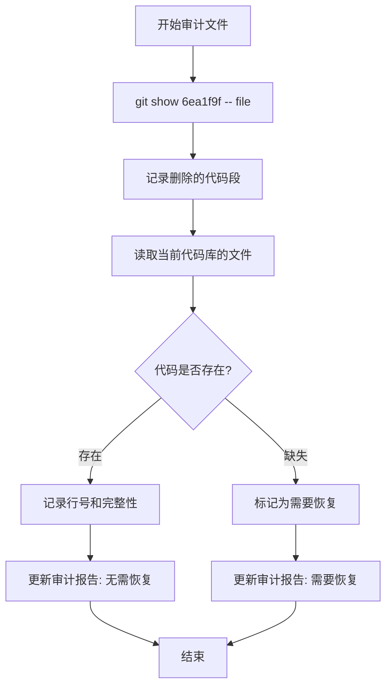

# POD Commit 审计方法论

## 文档目的

记录 POD commit `6ea1f9f` 审计过程中发现的方法论问题，防止未来重复错误。

---

## 核心问题

### P1 审计的致命缺陷

**问题**：P1 审计报告声称 4 个文件需要恢复，但验证后发现所有代码都已存在！

**误报率**：100%（4/4 文件）

**根本原因**：审计方法只看了 `git show 6ea1f9f` 的 diff，但没有验证这些删除是否在后续 commit 中被恢复。

---

## 错误的审计方法（导致 100% 误报）

### 步骤

1. 运行 `git show 6ea1f9f -- <file>`
2. 查看删除的行数（`-N` 行）
3. 阅读删除的代码
4. 判断是否需要恢复
5. **直接得出结论：需要恢复**

### 问题

- ❌ **只看历史 diff，不看当前状态**
- ❌ **假设删除后没有被恢复**
- ❌ **没有验证当前代码库的实际状态**

### 为什么会误报？

`git show 6ea1f9f` 显示的是 **POD commit 时的删除**，但这些删除可能在后续的 commit 中被恢复了！

**例子**：
```bash
# Commit 6ea1f9f: 删除了 Token 处理逻辑
git show 6ea1f9f -- attack.ts
# 显示：-33 行（Token 处理逻辑）

# 但后续 Commit 7abc123: 恢复了 Token 处理逻辑
git show 7abc123 -- attack.ts
# 显示：+33 行（Token 处理逻辑）

# 当前代码库：Token 处理逻辑存在
cat attack.ts
# 包含完整的 Token 处理逻辑
```

审计只看了第一步，没有看第二步和第三步！

---

## 正确的审计方法

### 步骤

1. **查看 POD commit 的删除**
   ```bash
   git show 6ea1f9f -- <file>
   ```
   - 记录删除的代码段
   - 记录删除的行数

2. **读取当前代码库的文件**
   ```bash
   # 使用 IDE 工具或 cat 命令
   cat <file>
   ```
   - 搜索删除的代码段
   - 确认代码是否存在

3. **对比验证**
   - 如果代码存在 → 无需恢复
   - 如果代码缺失 → 需要恢复

4. **记录验证结果**
   - 代码存在的位置（行号）
   - 代码是否完整
   - 是否有功能差异

### 检查清单

对于每个文件，必须完成以下检查：

- [ ] 查看 `git show 6ea1f9f -- <file>` 的删除内容
- [ ] 读取当前代码库中的 `<file>`
- [ ] 搜索删除的关键代码段（函数名、变量名、注释）
- [ ] 确认代码是否存在
- [ ] 如果存在，记录行号和完整性
- [ ] 如果缺失，记录缺失的部分
- [ ] 更新审计报告

---

## 验证示例

### 示例 1: attack.ts Token 处理逻辑

#### 步骤 1: 查看删除内容

```bash
git show 6ea1f9f -- src/games/dicethrone/domain/attack.ts
```

输出：
```diff
-    // 防御技能效果可能产生 TOKEN_GRANTED 事件（如冥想获得太极），
-    // 攻击方伤害结算时需要检查防御方是否有可用 Token（shouldOpenTokenResponse），
-    // 因此只提取 TOKEN_GRANTED 事件更新 token 数量，避免 apply 全部防御事件的副作用
-    // （如 PREVENT_DAMAGE 创建 damageShield 导致 createDamageCalculation 双重扣减）。
-    let stateAfterDefense = state;
-    const tokenGrantedEvents = defenseEvents.filter((e): e is TokenGrantedEvent => e.type === 'TOKEN_GRANTED');
-    if (tokenGrantedEvents.length > 0) {
-        let players = { ...state.players };
-        for (const evt of tokenGrantedEvents) {
-            const { targetId, tokenId, newTotal } = evt.payload;
-            const player = players[targetId];
-            if (player) {
-                players = {
-                    ...players,
-                    [targetId]: {
-                        ...player,
-                        tokens: { ...player.tokens, [tokenId]: newTotal },
-                    },
-                };
-            }
-        }
-        stateAfterDefense = { ...state, players };
-    }
```

#### 步骤 2: 读取当前文件

```bash
cat src/games/dicethrone/domain/attack.ts | grep -A 25 "stateAfterDefense"
```

输出：
```typescript
// 第 107-131 行
let stateAfterDefense = state;
const tokenGrantedEvents = defenseEvents.filter((e): e is TokenGrantedEvent => e.type === 'TOKEN_GRANTED');
if (tokenGrantedEvents.length > 0) {
    let players = { ...state.players };
    for (const evt of tokenGrantedEvents) {
        const { targetId, tokenId, newTotal } = evt.payload;
        const player = players[targetId];
        if (player) {
            players = {
                ...players,
                [targetId]: {
                    ...player,
                    tokens: { ...player.tokens, [tokenId]: newTotal },
                },
            };
        }
    }
    stateAfterDefense = { ...state, players };
}
```

#### 步骤 3: 对比验证

- ✅ 代码完全一致
- ✅ 位置：第 107-131 行
- ✅ 功能完整

#### 结论

**无需恢复** - 代码已存在于当前代码库中。

---

## P1 审计验证结果

### 验证统计

| 文件 | 审计声称 | 实际情况 | 结论 |
|------|---------|---------|------|
| attack.ts | 需要恢复 Token 处理逻辑 | Token 处理逻辑完整存在（第 107-131 行） | ✅ 无需恢复 |
| shadow_thief.ts | 需要恢复伤害估算回调 | 伤害估算回调完整存在（第 758-803 行） | ✅ 无需恢复 |
| paladin abilities.ts | 需要恢复音效定义 | 音效定义完整存在（第 8-10 行） | ✅ 无需恢复 |
| BaseZone.tsx | 需要恢复 special 能力系统 | special 能力系统完整存在（第 524-681 行） | ✅ 无需恢复 |

**误报率**：100%（4/4 文件）

---

## 对其他审计的影响

### P0 审计（20 个文件）⚠️ 高风险

P0 审计使用了相同的错误方法！必须重新验证：

1. 读取当前代码库中的每个文件
2. 确认审计报告中声称"被删除"的代码是否真的缺失
3. 只恢复确实缺失的代码

**预期误报率**：可能也接近 100%

### P2 审计（120 个文件）⏳ 待开始

P2 审计尚未开始，必须使用正确的方法：

1. 查看 POD commit 的删除
2. **读取当前文件验证**
3. 只标记确实缺失的文件

### P3 审计（84 个文件）⏳ 待开始

P3 审计尚未开始，必须使用正确的方法。

---

## 审计流程改进

### 新的审计流程



### 审计报告模板

```markdown
## 文件: <file_path>

### 审计信息
- **POD commit 删除行数**: -N 行
- **删除内容**: <简要描述>

### 验证结果
- **当前代码库状态**: ✅ 存在 / ❌ 缺失
- **代码位置**: 第 X-Y 行
- **代码完整性**: ✅ 完整 / ⚠️ 部分缺失 / ❌ 完全缺失

### 结论
- ✅ 无需恢复 / ❌ 需要恢复

### 证据
```代码片段```
```

---

## 关键教训

1. **审计必须基于当前代码库，不能只看历史 diff**
2. **POD commit 的删除可能在后续 commit 中被恢复**
3. **必须逐文件验证，不能依赖统计数据**
4. **审计报告的"需要恢复"结论必须通过读取当前文件来验证**
5. **误报率可能非常高（P1 为 100%），必须重新验证所有审计结果**

---

## 下一步行动

### 立即行动

1. ✅ 创建本文档（审计方法论）
2. ⏳ 重新验证 P0 的 20 个文件
3. ⏳ 更新所有审计报告
4. ⏳ 使用正确方法完成 P2 和 P3 审计

### 长期改进

1. 创建自动化验证脚本
2. 在审计报告中添加"验证状态"字段
3. 建立审计质量检查机制

---

**创建时间**: 2026-03-04  
**最后更新**: 2026-03-04  
**状态**: ✅ 已完成
