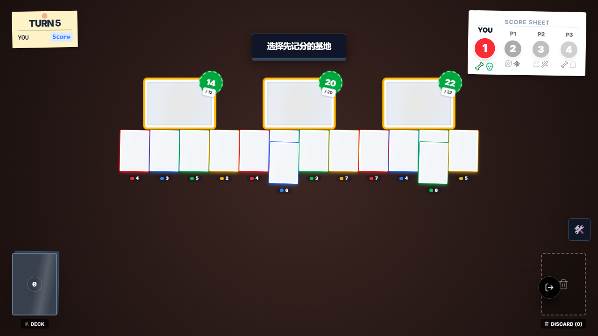
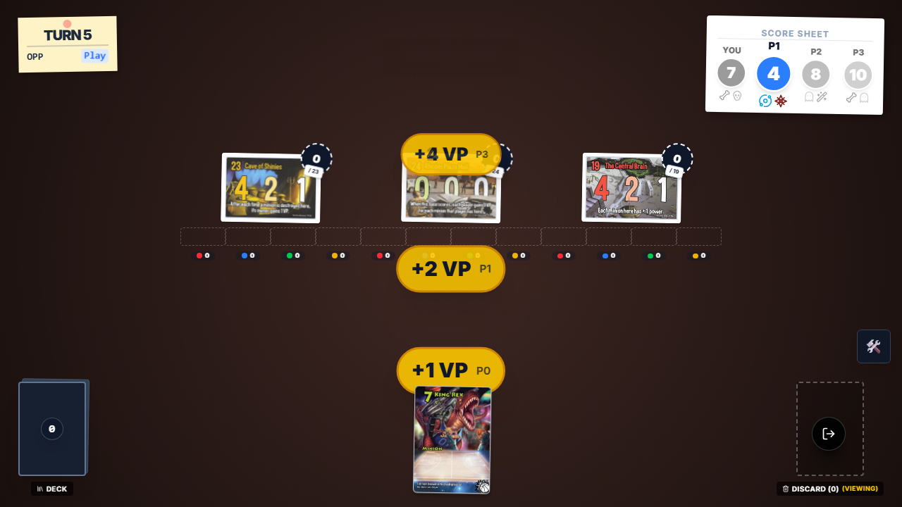

# Smash Up 四人局三基地同时计分 E2E 证据

## 本次目标

验证 `e2e/smashup-4p-layout-test.e2e.ts` 已经从“布局页占位测试”升级为真正的 4P 复杂场景 E2E，并覆盖：

1. 四人局中 3 个基地同时达标时，正确弹出 `multi_base_scoring` 选择交互
2. 选择第 1、2 个基地后，最后 1 个基地会自动完成收尾
3. 最后 1 个基地不会被重复计分、不会被重复替换

## 执行命令

- `PW_USE_DEV_SERVERS=true PW_WORKERS=1 PW_TEST_MATCH=e2e/smashup-4p-layout-test.e2e.ts npx playwright test --reporter=list`
- `npx vitest run src/games/smashup/__tests__/multi-base-afterscoring-bug.test.ts`
- `node .\node_modules\typescript\bin\tsc --noEmit --pretty false`

## 关键结论

- `src/games/smashup/domain/index.ts` 已修复 `multi_base_scoring` 的“剩 1 个基地自动计分”分支：现在也会立即写入 `sys.scoredBaseIndices`。
- 这次修的是根因，不是只改 E2E 断言：如果不标记最后 1 个基地，`onPhaseExit('scoreBases')` 会在交互关闭后的自动推进里把它再记一遍。
- `e2e/smashup-4p-layout-test.e2e.ts` 已对齐真实产品语义：前两次由玩家决定顺序，最后 1 个基地自动收尾，不再错误等待一个额外的“最后基地”选择 Prompt。
- 本地验证已改为复用已开启开发服务（`5173/18000/18001`）+ 单 worker + 无头，不再额外拉起隔离服务，能明显降低本机卡顿。

## 截图审查

### 1. 三基地同时达标，弹出多基地选择交互

审查结论：

- 右上角计分板明确显示 `YOU / P1 / P2 / P3` 四名玩家，说明这是实际 4P 对局，不是 2P/3P 退化布局。
- 三个基地的总力量气泡分别是 `14/12`、`20/20`、`22/22`，三个基地都已同时达到 breakpoint。
- 中央 Prompt 显示“选择先记分的基地”，与 `multi_base_scoring` 的预期入口一致。

### 2. 先选沙皇宫殿后，仍保留两基地顺序选择

审查结论：

- 右上角分数变为 `P0=6 / P1=2 / P2=6 / P3=6`，正好对应 `base_tsars_palace` 的一次结算：`+5 / +0 / +3 / +2`。
- 右侧新翻开的基地已经变成 `Central Brain`，说明第一个被选中的基地完成了替换。
- 画面中央仍保留“选择先记分的基地” Prompt，说明剩余两个基地没有被跳过，而是继续等待第二次顺序选择。

### 3. 第二次选择后，最后一个基地自动收尾且只结算一次

审查结论：

- 最终分数是 `P0=7 / P1=4 / P2=8 / P3=10`，与预期完全一致；没有出现之前那种最后一个基地重复记分导致的 `8 / 6 / 8 / 14` 异常结果。
- 三个基地最终依次是 `Cave of Shinies / Rhodes Plaza Mall / Central Brain`，三个替换结果互不重复，证明最后一个基地没有被重复替换。
- 棋盘上所有基地都为空，说明三个基地的清场流程都完整结束。
- 画面上只剩最后一个基地的 VP 气泡 `+1 VP P0 / +2 VP P1 / +4 VP P3`，与 `base_dread_lookout` 的一次正常结算一致，也说明它没有第二次重复发奖。

## 最终结果

- `e2e/smashup-4p-layout-test.e2e.ts`：2/2 通过
- `src/games/smashup/__tests__/multi-base-afterscoring-bug.test.ts`：3/3 通过
- `tsc --noEmit`：通过
